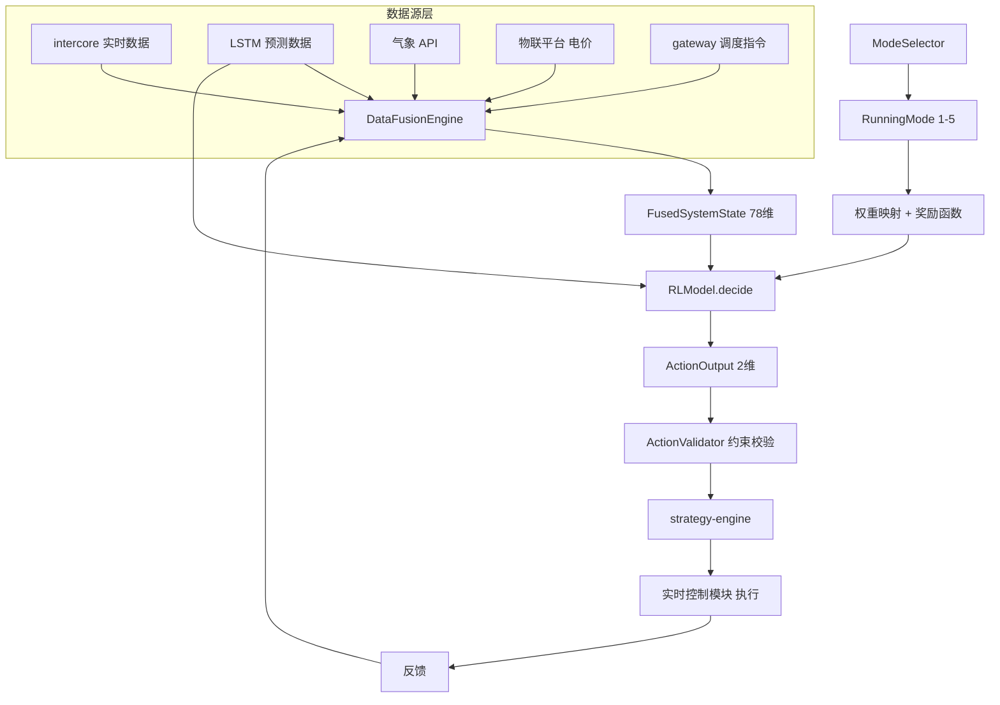

# MUPC AI 优化引擎 - 模块产品需求文档（统一版 v3.1）

> **版本：** v3.1 | **状态：** [REVIEWED: PASS] | **更新日期：** 2026-06-21

### 变更记录

| 版本 | 日期 | 作者 | 变更说明 | 评审状态 |
|------|------|------|----------|----------|
| v3.1 | 2026-06-21 | 架构师 | 第 3 章系统性重构：将 v2.16/v3.0 版本增量描述合并为统一分层混合架构描述（MIC→VMD→LSTM+Attention→误差修正→MSSA），§3.7 安全 RL 包装器移至 §6.7 | [REVIEWED: PASS] |
| v3.0 | 2026-06-21 | 需求分析师 | 预测增强分层混合架构：VMD 信号分解 + Attention 注意力机制 + BiLSTM 增强 + 误差修正 BiLSTM + MSSA 超参优化，五层混合架构提升光伏/负荷预测精度 | [REVIEWED: PASS] |
| v2.17 | 2026-06-18 | 需求分析师 | 安全 RL 包装器：物理模型事前预测拒绝、线路阻抗配置化、RobustnessManager 协同、Web API 状态端点、Web UI 监控面板 | [REVIEWED: PASS] |
| v2.16 | 2026-06-18 | 需求分析师 | LSTM 模型优化：步长统一为 15 分钟、15 步分位数预测、D10 数据流通、删除 confidence 字段、消除冗余推理 | [REVIEWED: PASS] |
| v2.15 | 2026-06-17 | 需求分析师 | 动作空间精简：5维→2维（移除load_shedding/pv_limit/confidence），下沉至策略引擎 | [REVIEWED: PASS] |
| v2.14 | 2026-06-15 | - | SafetyOverride 奖励函数重构、FusedSystemState 78维统一 | [REVIEWED: PASS] |
| v2.13 | 2026-06-14 | - | Sigmoid P-Q平滑化、Welford奖励归一化、confidence字段 | [REVIEWED: PASS] |

---

## 1. 产品概述

### 1.1 产品定位

AI 优化引擎是 MUPC 通信管理模块（"大脑"）的核心智能决策组件，负责根据实时运行数据和外部信息进行时序预测、场景识别与强化学习决策，生成最优控制指令下发给实时控制模块（"小脑"）执行。

AI 引擎遵循 **"AI 优先，本地兜底"** 策略：正常时 AI 引擎主导决策，AI 失效时自动、无缝地降级至本地策略引擎（strategy-engine）接管控制。

### 1.2 核心职责

| 职责 | 说明 |
|------|------|
| 时序预测 | LSTM 模型预测光伏出力 / 负荷变化趋势（含分位数预测） |
| 预设运行场景选择 | 5 种预设运行场景，支持远程控制/本地选择，同一时刻仅 1 种互斥运行 |
| 多目标决策 | MADDPG/PPO 强化学习模型，2 维动作空间，5 种奖励函数 |
| 数据融合 | 融合电气量、电池数据、电价、气象、调度指令等 10 大类 **78 维**状态 |
| NPU 推理 | 在 RK3588 NPU 上执行 INT8 量化模型推理 |
| 在线微调 | 基于新数据持续更新模型权重（影子模型验证 + 渐进式切换） |
| 安全校验 | 输出指令经 ActionValidator 约束校验后再下发 |

### 1.3 目标平台

| 项目 | 要求 |
|------|------|
| 硬件 | RK3588 (NPU: 6 TOPS) |
| 操作系统 | openEuler 22.03+ |
| 编程语言 | Rust >= 1.75 |
| 异步运行时 | Tokio |
| 推理框架 | RKNN Runtime (INT8 量化) |
| 模型格式 | ONNX（训练）→ .rknn（部署） |
| 训练平台 | x86 服务器（PyTorch + rknn-toolkit2） |

### 1.4 核心价值

| 价值 | 说明 | 量化目标 |
|------|------|----------|
| 预设场景互斥 | 5 种预设运行场景，调度主站远程/本地选择，互斥运行保证确定性 | 场景切换延迟 < 2s（远程）、< 1s（本地） |
| 多目标优化 | 根据不同场景动态平衡经济收益、设备寿命、电网安全 | 综合目标函数值提升 >= 20%（相比固定策略） |
| 全维度决策 | 覆盖有功、无功两个控制维度 | 无功调节覆盖率 100% |
| 可量化训练 | 每个场景有明确奖励公式，模型训练目标可量化 | 奖励函数可计算误差 < 1% |

### 1.5 用户角色

| 角色 | 描述 | 权限范围 |
|------|------|----------|
| **调度主站** | 上级调度中心，通过 IEC 104/IEC 61850 远程指挥台区运行 | 远程切换运行场景（最高优先级）、下发调度指令 |
| **AI 运维人员** | 负责 AI 模型训练、部署、监控和维护的技术人员 | 模型版本管理、推理参数配置、在线微调启停、Web UI 决策可视化（预测曲线、决策逻辑、实时奖励，详见模块08-PRD 第6章） |
| **策略管理员** | 负责本地选择运行场景和调整权重的电力系统运维人员 | 本地场景切换、场景权重配置、奖励函数参数调整、Web UI 决策可视化（预测曲线、决策逻辑、实时奖励，详见模块08-PRD 第6章） |
| **本地运维人员** | 负责 MUPC 装置日常运维的操作人员 | 查看运行场景/AI 决策日志、接收告警、强制降级至本地策略 |

**权限优先级规则：**
- 调度主站远程切换运行场景优先级最高（全局电网调度视角）
- 策略管理员本地切换运行场景，冲突时远程指令优先
- AI 运维人员可配置所有模型参数和训练参数，但不能切换运行模式
- 本地运维人员可强制降级至本地策略模式，覆盖 AI 输出

### 1.6 整体架构

```
┌─────────────────────────────────────────────────────────────────┐
│                     AI 优化引擎 (ai-engine)                         │
├─────────────────────────────────────────────────────────────────┤
│  ┌─────────────┐    ┌─────────────┐    ┌─────────────┐        │
│  │ LSTM 预测    │    │MADDPG/PPO   │    │ 在线微调    │        │
│  │ (时序预测)   │    │ (决策优化)   │    │ (持续学习)   │        │
│  └──────┬──────┘    └──────┬──────┘    └──────┬──────┘        │
│         │                   │                   │               │
│         └───────────────────┼───────────────────┘               │
│                       ┌────▼────┐                              │
│                       │ 模型    │                              │
│                       │ 管理器  │                              │
│                       └────┬────┘                              │
│                   ┌────────┼────────┐                         │
│                   ▼        ▼        ▼                          │
│  ┌──────────┐ ┌────────┐ ┌──────────────┐                    │
│  │ 数据融合 │ │ 模式   │ │ 奖励函数     │                    │
│  │ 引擎     │ │ 选择器 │ │ 计算器       │                    │
│  └──────────┘ └────────┘ └──────────────┘                    │
│                             │                                  │
│                    ┌────────▼────────┐                        │
│                    │ 动作约束校验器   │                        │
│                    └────────┬────────┘                        │
│                             │                                  │
│                    ┌────────▼────────┐                        │
│                    │  RKNN Runtime   │ ←→ librknnrt.so (FFI) │
│                    │  (NPU 推理)     │                        │
│                    └─────────────────┘                        │
└─────────────────────────────────────────────────────────────────┘
         │                        │
         ▼                        ▼
┌─────────────────┐    ┌──────────────────────┐
│  strategy-engine│    │  data-processing     │
│ (指令校验 + 兜底)│    │ (数据管道 + MQTT)    │
└─────────────────┘    └──────────────────────┘
```

### 1.7 数据流

```
历史数据 → LSTMModel.predict() → 光伏/负荷预测值 → 供 RL 模型使用
                                                         ↓
远程指令/本地选择 → ModeSelector → 运行模式 → 权重映射 + 奖励函数选择
                                                         ↓
融合数据 + 预测值 + 运行模式 → RLModel.decide() → ActionOutput
                                                         ↓
ActionOutput → ActionValidator (5条约束规则校验) → strategy-engine
                                                         ↓
新数据积累 → OnlineUpdater.update() → 模型权重增量更新 → 保存
```

---

## 2. 核心业务流程图



---

## 3. 预测增强分层混合架构

### 3.1 架构总览

AI 引擎的时序预测管线采用**分层混合架构**，吸收 4 篇学术论文中经过验证的预测方法，以分层叠加方式提升光伏出力与台区负荷的预测精度。各层独立可插拔：离线特征筛选与 CPU 预处理对推理延迟零影响，神经网络增强在 NPU 上执行，超参优化仅影响训练阶段。

**设计依据：**

| 方法 | 吸收来源 | 作用层 |
|------|----------|--------|
| VMD 变分模态分解 | 袁晓燕 (VMD-ISPO-BiLSTM) | 信号预处理 |
| MIC 最大信息系数 | 袁晓燕 (VMD-ISPO-BiLSTM) | 特征筛选 |
| Additive Attention | 李帅 (MSSA-BiLSTM-AT) | 神经网络增强 |
| BiLSTM 误差修正 | 王林 (CEEMDAN-SE + BiLSTM EC) | 残差修正 |
| MSSA 超参优化 | 李帅 (MSSA-BiLSTM-AT) | 训练自动化 |

**分层架构：**

```
┌──────────────────────────────────────────────────────────────────┐
│                    预测增强分层混合架构（五层）                      │
├──────────────────────────────────────────────────────────────────┤
│                                                                   │
│  原始特征 ──→ [第1层] MIC 特征筛选（离线）                          │
│                  │                                                 │
│  筛选后特征 ──→ [第2层] VMD 信号分解（CPU）                         │
│                  │                                                 │
│  分解子模态 ──→ [第3层] LSTM + Attention（NPU，必选）               │
│                  │  或 BiLSTM + Attention（NPU，可选 Go/No-Go）      │
│                  │                                                 │
│  初步预测残差 ──→ [第4层] BiLSTM 误差修正（NPU，可选）               │
│                  │                                                 │
│  训练阶段 ──→ [第5层] MSSA 超参自动搜索（离线）                     │
│                                                                   │
│  [输出层] 15 步分位数预测（P10/P50/P90，FusedSystemState D2/D10）   │
└──────────────────────────────────────────────────────────────────┘
```

**对下游系统的透明性：**
- FusedSystemState D2/D10 字段定义、维度、取值范围不变
- LstmOutput 结构不变，下游 RL 决策模型与策略引擎无需修改
- 推理接口签名保持兼容
- NPU 推理延迟上限保持 < 1s

### 3.2 输入特征工程与 MIC 筛选

#### 3.2.1 特征池

| 特征 | 状态 | 说明 |
|------|------|------|
| pv_power | 已使用 | 光伏出力历史序列 |
| load_power | 已使用 | 负荷功率历史序列 |
| ghi | 已使用 | 太阳辐照度 |
| temp | 已使用 | 环境温度 |
| hour_sin | 已使用 | 小时正弦编码 |
| hour_cos | 已使用 | 小时余弦编码 |
| yesterday_pv | 已使用 | 昨日同一时刻光伏值 |
| humidity | 候选扩展 | 湿度 |
| wind_speed | 候选扩展 | 风速 |
| day_of_week_sin/cos | 候选扩展 | 星期编码 |
| is_holiday | 候选扩展 | 节假日标志 |
| month_sin/cos | 候选扩展 | 月份编码 |
| pv_3day_avg | 候选扩展 | 过去 3 天同时刻光伏均值 |
| load_3day_avg | 候选扩展 | 过去 3 天同时刻负荷均值 |

#### 3.2.2 MIC 离线特征筛选

在离线训练阶段，使用 MIC（最大信息系数）对候选输入特征进行相关性排序，筛选 Top-K 个特征（默认 K=7）作为 LSTM 模型输入。MIC 能够捕获线性和非线性关系，适用性优于皮尔逊相关系数。

MIC 分析以离线 Python 脚本方式运行（不进入 RK3588 部署路径），输出 JSON 供训练管线直接消费。若扩展候选特征的数据源不可用（如 humidity/wind_speed 缺失），分析脚本自动跳过该特征。

**MIC 输入 CSV 格式要求：** UTF-8 编码，逗号分隔，首行为列名，时间戳为 ISO 8601 格式（`YYYY-MM-DDTHH:MM:SS`），最小 8640 行（90 天 × 96 点/天），缺失值用空字段或 `NaN` 表示。

### 3.3 信号分解预处理（VMD）

#### 3.3.1 分解原理与流程

VMD（Variational Mode Decomposition）将原始时间序列 x(t) 分解为 K 个具有有限带宽的子模态 u_k(t)，每个子模态围绕中心频率 omega_k 聚集。分解后的子模态比原信号更平稳，LSTM 更容易学习其时序模式。

```
原始序列 x(t) → VMD 分解 → [IMF_1, IMF_2, ..., IMF_K]
    → 各 IMF 分别输入 LSTM + Attention 推理（NPU）
    → 各 IMF 预测值求和重构 → 最终预测
```

#### 3.3.2 关键参数

| 参数 | 符号 | 默认值 | 可配置范围 | 说明 |
|------|------|--------|------------|------|
| 模态数 | K | 光伏 5，负荷 6 | [2, 10] | 不同预测对象使用独立 K 值 |
| 惩罚因子 | alpha | 2000 | [100, 5000] | 带宽约束强度 |
| 收敛容差 | tol | 1e-6 | [1e-7, 1e-5] | 迭代收敛判据 |
| 最大迭代次数 | max_iter | 500 | [100, 2000] | 防止无限循环 |

**预测对象与 K 值推荐：**

| 预测对象 | 推荐 K | 理由 |
|----------|--------|------|
| 光伏出力 | 4~6 | 光伏主要受辐照度日周期主导，模态结构相对简单 |
| 台区负荷 | 5~8 | 负荷含基荷、周期性、随机波动等多尺度成分 |

#### 3.3.3 推理阶段集成

**实现方式：** VMD 以纯 Rust（rustfft + nalgebra）在 CPU 上执行，不依赖外部 C/C++ 库，避免 aarch64-openEuler 交叉编译问题。

**执行约束：** VMD 分解在 CPU 上执行，不属于 NPU 推理管线，单次分解预算 ≤ 50ms（输入窗口 24 步）。分解失败时自动回退到不使用 VMD 的原始序列直接推理。

**K 值管理：** K 值由训练阶段通过 MSSA 搜索确定后写入配置文件，推理端固定使用，不做在线自适应调整。

### 3.4 神经网络预测（LSTM + Attention + BiLSTM）

#### 3.4.1 步长与窗口统一

预测管线使用统一时间步长，通过配置参数计算输入/输出窗口步数：

| 配置参数 | 默认值 | 说明 |
|----------|--------|------|
| `step_seconds` | 900（15 分钟） | 时间步长，与训练管线 MUPC-AI2 对齐 |
| `input_window_secs` | 21600（6 小时） | 输入窗口总时长 |
| `output_horizon_secs` | 22500（225 分钟） | 预测视野总时长 |
| **input_window** | **21600 / 900 = 24 步** | 输入序列长度 |
| **output_horizon** | **22500 / 900 = 15 步** | 输出预测长度 |

MSSA 可在离线搜索阶段对 `input_window`（{12, 24, 36}）进行优化，训练完成后冻结。

#### 3.4.2 LSTM 基线架构

LSTM 编码器接收输入序列 `(batch, 24, K_features)`，输出隐状态序列 `(batch, 24, hidden_dim)`：

| 超参 | 搜索范围 | 说明 |
|------|----------|------|
| hidden_dim | {32, 64, 96, 128} | 由 MSSA 搜索确定 |
| num_layers | {1, 2, 3} | 由 MSSA 搜索确定 |
| dropout | [0.0, 0.5] | 仅在 num_layers > 1 时生效 |

#### 3.4.3 Additive Attention 注意力机制（必选）

在 LSTM 输出序列 H = [h_1, ..., h_T] 之上施加加法注意力（Bahdanau Attention）：

1. 评分函数：`score_t = v^T · tanh(W · h_t)`，输出标量
2. Softmax 归一化：`alpha_t = softmax(score)_t`
3. 上下文向量：`c = Σ alpha_t · h_t`
4. 全连接头：6 头 Linear（PV/Load × P10/P50/P90），生成 15 步分位数预测

**关键设计决策：** Attention 层由训练管线嵌入 ONNX 计算图（所有算子均为 ONNX 标准：Gemm + Tanh + Softmax + Mul + ReduceSum），在 NPU 上执行，Rust 推理端零代码介入。

Attention 层增加的参数量约 5-10%，NPU 推理延迟增加 ≤ 15%。ONNX 额外输出节点 `attention_weights`（shape=[input_window]）可供 AI 运维人员导出注意力可视化数据做离线分析。

#### 3.4.4 BiLSTM 双向增强（可选，Go/No-Go 准入）

将单向 LSTM 替换为 BiLSTM：

- 前向 LSTM：处理从 t-T 到 t 的正向序列
- 后向 LSTM：处理从 t 到 t-T 的反向序列
- 拼接前向和后向隐状态后送入 Attention 层

**准入条件（Go/No-Go Gate）：**

| 条件 | 结果 |
|------|------|
| P99 推理延迟 < 900ms（在 RK3588 上 ≥1000 次推理实测） | **Go** — BiLSTM 可启用 |
| P99 推理延迟 ≥ 900ms | **No-Go** — BiLSTM 禁用，降级至单向 LSTM |

`gate_passed` 结果通过硬件延迟摸底测试确定后写入配置文件 `bilstm.gate_passed`，启动时读取。BiLSTM 默认禁用（`enabled: false`）。

**参数量约束：** BiLSTM 启用时参数量 ≤ 单向 LSTM 的 2.2 倍（允许全连接层等共享部分）。

#### 3.4.5 模型文件管理

推理端管理 3 个独立的 `.rknn` 模型文件，每个使用独立的 `RknnRuntime` 实例：

| 模型文件 | 轮次 | 必须 | INT8 大小上限 | 说明 |
|----------|------|------|---------------|------|
| `lstm_attn.rknn` | R1 | **是** | ≤ 8MB | 单向 LSTM + Attention |
| `bilstm_attn.rknn` | R2 | 否 | ≤ 12MB | 双向 LSTM + Attention，Go/No-Go 控制 |
| `error_correction.rknn` | R2 | 否 | ≤ 3MB | 独立轻量误差修正 BiLSTM |

三个模型独立 OTA 升级/降级，降低耦合风险。`bilstm_attn.rknn` 和 `error_correction.rknn` 的 `RknnRuntime` 归属于 `PredictionPipeline`（非 `ModelManager`），实现关注点分离。

### 3.5 误差修正管线

#### 3.5.1 两阶段预测架构

```
阶段1（主预测）:
  原始序列 → [VMD 分解] → LSTM/Attention → 初步预测值 y_pred_1

阶段2（误差修正）:
  训练阶段：残差 e = y_true - y_pred_1 → 训练独立 BiLSTM 学习残差时序模式
  推理阶段：BiLSTM 输入最近 T 步已知残差 → 预测未来残差 e_pred
    → y_pred_2 = y_pred_1 + e_pred
```

#### 3.5.2 误差修正 BiLSTM 规格

| 属性 | 规格 |
|------|------|
| 输入 | 最近 24 步历史残差（在线推理时使用观测残差；刚启动时使用零向量） |
| 输出 | 未来 15 步预测残差 |
| 参数量 | ≤ 主预测 LSTM 参数的 50% |
| 模型大小 | ≤ 3MB（INT8） |
| NPU 推理延迟 | ≤ 200ms |

误差修正 BiLSTM 与主预测模型串行执行（NPU 单任务限制），不参与 Attention 增强，不在残差上做 VMD 二次分解。

#### 3.5.3 触发条件与故障处理

| 场景 | 行为 |
|------|------|
| 训练阶段 Bias > 3% MAPE | 启用误差修正；否则跳过训练，推理端不加载 |
| 在线推理时残差缓冲区不足 | `zero_init=true` 使用零向量；`zero_init=false` 等待 |
| 连续 3 次推理失败 | 自动禁用误差修正，输出原始预测值 |
| 误差修正开启且连续 5 次成功 | 恢复至正常增强级别 |

### 3.6 分位数预测输出

#### 3.6.1 输出结构

LSTM 模型输出 15 步分位数预测，覆盖 PV 和 Load 两个预测对象，每步含三个分位数：

```
(B, input_window, K_features) → LSTM + Attention → (B, 2, 15, 3)
                                                      ↑  ↑   ↑
                                                      │  │   P10/P50/P90
                                                      │  15 步
                                                      PV / Load
```

| 字段 | 维度 | 说明 |
|------|------|------|
| pv_forecast | 15 | 光伏 P50 点预测（用于 RL 决策 D2） |
| load_forecast | 15 | 负荷 P50 点预测（用于 RL 决策 D2） |
| load_forecast_quantiles | 15 | 负荷 P90 分位数（用于 D10 冲击预备度） |
| shock_load_probability | 1 | 基于 P90-P50 spread 计算的冲击概率 |
| base_load | 1 | 第 1 步 P50 负荷值 |

#### 3.6.2 D10 数据流

预测管线的分位数输出通过 `update_fused_state_quantiles()` 写入 `FusedSystemState` D10 段（17 维 = 15 维分位数 + 1 维冲击概率 + 1 维基荷），RL 决策模型通过 D10 读取分位数信息用于冲击负荷预备度奖励计算。

`predict()` 仅触发 1 次 NPU 推理，同时返回点预测和分位数预测，消除冗余 NPU 调用。

#### 3.6.3 输出维度校验

`predict()` 在输出长度不足时返回 `OutputShapeMismatch` 错误（不静默截断），防止数据丢失在无感知情况下影响 RL 决策。

### 3.7 降级层级与自动升降级

#### 3.7.1 降级层级

预测管线定义 8 级降级层级，从全功能（Level 0）到安全兜底（Level 5），逐级回退：

| 层级 | 枚举值 | 管线状态 | 触发条件 |
|------|--------|----------|----------|
| 0 | FullVmdAttentionCorrection | VMD + (Bi)LSTM/Attention + 误差修正 | 全功能正常 |
| 1 | BiLstmVmdAttention | BiLSTM + VMD + Attention（无误差修正） | 误差修正失败或 disabled |
| 2 | VmdAttention | VMD + LSTM/Attention | BiLSTM No-Go 或 BiLSTM 失败降级 |
| 3 | AttentionOnly | LSTM/Attention（无 VMD） | VMD 不收敛或超时 |
| 4 | Baseline | 纯 LSTM（无 VMD，无 Attention） | Attention ONNX 节点异常 |
| 5 | —（全零预测） | 安全兜底 | 所有模型推理失败，ModelManager 处理 |

Level 0-4 由 `PredictionPipeline` 内部管理，Level 5 由 `ModelManager` 调用方处理。

#### 3.7.2 自动升降级逻辑

| 规则 | 条件 | 动作 |
|------|------|------|
| VMD 恢复 | VMD 连续 5 次推理成功 | 升级一级（如 Level 3 → Level 2） |
| VMD 降级 | VMD 迭代不收敛或超时 | 降级至 `AttentionOnly`（跳过 VMD） |
| Attention 降级 | Attention ONNX 节点异常 | 降级至 `Baseline` |
| 误差修正恢复 | 误差修正连续 5 次成功 | 升级至 `FullVmdAttentionCorrection` |
| 误差修正降级 | 连续 3 次推理失败 | 自动禁用误差修正 |
| BiLSTM 降级 | BiLSTM 推理失败 | 降级至单向 LSTM，保留 VMD + 误差修正 |

升降级状态记录在 `PipelineHealth` 结构体中，通过 Web API 端点暴露供运维人员监控。

### 3.8 超参自动优化（MSSA）

#### 3.8.1 算法概述

MSSA（Multi-Strategy Sparrow Search Algorithm，多策略麻雀搜索算法）在离线训练阶段自动搜索最优超参数组合。算法利用"发现者-加入者-侦察者"三群体协同机制，结合佳点集初始化、反向学习增强、Corsi 变异扰动三种策略提升全局搜索能力。

MSSA 以纯 Python 离线工具（`tools/mssa_optimizer/`）形式运行，不进入 RK3588 部署路径。IPSO（改进粒子群优化）作为备选方案：若 MSSA 搜索时间超过 2 小时或 3 次重启后 MAPE 仍劣于人工基线 × 1.1，自动降级为 IPSO。

#### 3.8.2 搜索空间（10 维混合编码）

| 超参数 | 搜索范围 | 类型 |
|--------|----------|------|
| hidden_size | {32, 64, 96, 128} | 离散 |
| num_layers | {1, 2, 3} | 离散 |
| attn_score | {additive, dot, general} | 枚举 |
| vmd_k（光伏/负荷独立） | [2, 10] | 整数 |
| vmd_alpha | [100, 5000] | 连续 |
| lr | [1e-4, 1e-2] | log 连续 |
| batch_size | {16, 32, 64, 128} | 离散 |
| dropout | [0.0, 0.5] | 连续 |
| optimizer | {Adam, AdamW, RMSprop} | 枚举 |
| input_window | {12, 24, 36} | 离散 |

**目标函数（最小化）：** 验证集加权 MAPE = 0.5 × MAPE_pv + 0.5 × MAPE_load

**终止条件：** 任一满足即停止 —— (1) 达到最大迭代次数 50；(2) 连续 10 次迭代改善 < 1e-4；(3) 总搜索时间超过 2 小时。

#### 3.8.3 训练管线接口

MSSA 通过 subprocess 调用训练脚本，传递临时 JSON 配置文件，解析 stdout 输出的 MAPE 值：

```
PV_MAPE=0.073 LOAD_MAPE=0.11
```

搜索结果以 JSON 格式输出（含最优超参、目标函数值、收敛曲线、各超参搜索轨迹），可直接被训练管线读取。搜索支持 SHA256 指纹缓存跨运行持久化，训练数据变更时自动失效。

### 3.9 接口定义

#### 3.9.1 模型输入

```rust
/// LSTM 模型输入（经 MIC 筛选后的特征序列）
pub struct LstmInput {
    /// 输入窗口步数（默认 24，由 input_window_secs / step_seconds 计算）
    pub window_size: usize,
    /// 筛选后的特征维度（默认 7，由 MIC top_k 确定）
    pub num_features: usize,
}
```

#### 3.9.2 模型输出

```rust
/// 模型预测输出（增强后仍返回相同结构）
pub struct LstmOutput {
    pub pv_forecast: Vec<f32>,              // 光伏 P50 点预测（15 维）
    pub load_forecast: Vec<f32>,             // 负荷 P50 点预测（15 维）
    pub load_forecast_quantiles: Vec<f32>,   // 负荷 P90 分位数（15 维）
    pub shock_load_probability: f32,         // 冲击负荷概率
    pub base_load: f32,                      // 基础负荷（第 1 步 P50）
}
```

注意：`confidence` 字段已删除（原算法基于预测序列方差，数学上无意义）。策略引擎中的 confidence 来自 `ModelOutput` 元数据字段，与 LSTM 无关。

#### 3.9.3 概率负荷输出

```rust
pub struct ProbabilisticLoadOutput {
    pub timestamp: i64,
    /// 15 步分位数预测（每步含 P10/P50/P90）
    pub quantile_steps: Vec<StepQuantiles>,
    pub base_load: f32,           // 第 1 步 P50
    pub shock_probability: f64,   // 基于 P90-P50 spread 计算
}

pub struct StepQuantiles {
    pub step_index: usize,        // 0..14
    pub p10: f32,                 // 下分位数
    pub p50: f32,                 // 中位数
    pub p90: f32,                 // 上分位数
}
```

### 3.10 配置结构

预测增强配置通过 `PredictionEnhancementConfig` 统一管理，挂载在 `AiEngineConfig` 下。整个 `prediction_enhancement` 段缺失时默认禁用所有增强。

```yaml
prediction_enhancement:
  # ── R1：VMD + Attention（默认启用）──
  vmd:
    enabled: true
    k_pv: 5
    k_load: 6
    alpha: 2000.0
    tau: 0.0
    tol: 1.0e-6
    max_iter: 500

  attention:
    enabled: true

  # ── R2：BiLSTM + 误差修正（默认禁用）──
  bilstm:
    enabled: false
    model_path: "models/bilstm_attn.rknn"
    gate_passed: false          # 由硬件延迟摸底测试结果写入
    fallback_on_failure: true

  error_correction:
    enabled: false
    model_path: "models/error_correction.rknn"
    residual_window_steps: 24
    zero_init: true
    auto_disable_after_failures: 3
    enable_bias_check: true

  # ── 特征筛选 ──
  feature_selection:
    mic_top_k: 7
    mic_result_path: "models/mic_analysis.json"
```

**热加载策略：** `enabled` 类开关在下一个推理周期生效；VMD 参数（K、alpha、tol）变更需重新初始化分解器；模型路径变更需重新加载对应的 RknnRuntime。

### 3.11 预测精度要求

| 指标 | 第 1 步（15 分钟） | 第 15 步（225 分钟） | 验证方法 |
|------|-------------------|---------------------|----------|
| 光伏预测 MAPE | ≤ 8.5%（R1）/ ≤ 7.5%（R2） | ≤ 22%（R1）/ ≤ 18%（R2） | 测试集（≥ 30 天）回测 |
| 负荷预测 MAPE | ≤ 13%（R1）/ ≤ 12%（R2） | ≤ 28%（R1）/ ≤ 24%（R2） | 测试集（≥ 30 天）回测 |
| 峰谷时段（6:00-8:00, 18:00-20:00） | ≤ 日均 MAPE × 1.3（R1）/ × 1.15（R2） | — | 分时段回测 |

**增强效果指标：**

| 增强 | 相对改善目标 |
|------|-------------|
| VMD 分解 | MAPE 降低 ≥ 5%（vs 无 VMD 基线） |
| Attention 注意力 | MAPE 降低 ≥ 5%（vs 纯 LSTM 基线）；峰谷时段降低 ≥ 10% |
| 误差修正 | MAPE 绝对降低 ≥ 3%；Bias 绝对值 ≤ 修正前 40% |

### 3.12 验收标准

#### 3.12.1 MIC 特征筛选

| ID | 标准 | 验证方法 |
|----|------|----------|
| MIC-01 | MIC 分析接受 >= 90 天 CSV，输出每特征 MIC 值 | 离线脚本测试 |
| MIC-02 | 特征按 MIC 降序排列，Top-K 可配置（默认 K=7） | 离线脚本测试 |
| MIC-03 | MIC 筛选后 MAPE 不劣于全特征基线（增加 ≤ 1%） | 离线回测 |
| MIC-04 | MIC 结果以 JSON 格式持久化 | 文件格式验证 |
| MIC-05 | JSON 可被训练管线直接读取 | 端到端测试 |
| MIC-06 | 候选特征数据源不可用时自动跳过 | 离线脚本测试 |

#### 3.12.2 VMD 信号分解

| ID | 标准 | 验证方法 |
|----|------|----------|
| VMD-01 | 输入 24 步序列，输出 K 个子模态，长度与输入相同 | 单元测试 |
| VMD-02 | 各 IMF 求和重构 RMSE ≤ 1e-4 | 单元测试 |
| VMD-03 | 不同预测对象使用独立 K 值 | 配置测试 |
| VMD-04 | CPU 单次分解 ≤ 50ms | 性能测试 |
| VMD-05 | VMD 后 MAPE 比基线降低 ≥ 5%（相对） | 离线回测 |
| VMD-06 | 迭代不收敛时自动回退到无 VMD 模式 | 单元测试 |
| VMD-07 | alpha、tol、max_iter 可配置，缺失时使用默认值 | 配置测试 |

#### 3.12.3 LSTM + Attention + BiLSTM

| ID | 标准 | 验证方法 |
|----|------|----------|
| LSTM-01 | 模型加载成功，metadata 交叉校验通过 | 单元测试 |
| LSTM-02 | 推理延迟 < 1s（全管线） | 性能测试 |
| LSTM-03 | ONNX 模型格式正确，ONNX checker 通过 | 模型验证 |
| LSTM-04 | INT8 .rknn 文件 ≤ 8MB（lstm_attn）/ ≤ 12MB（bilstm_attn） | 文件大小验证 |
| LSTM-05 | 预测输出长度固定 15，不足时返回 OutputShapeMismatch | 单元测试 |
| ATT-01 | Attention 输出维度与 LSTM 隐状态维度一致 | 单元测试 |
| ATT-02 | 注意力权重和为 1.0（softmax 归一化） | 单元测试 |
| ATT-03 | 注意力权重向量长度 = 输入序列长度 | 单元测试 |
| ATT-04 | Attention 层 NPU 推理延迟增加 ≤ 15% | 性能测试 |
| ATT-05 | Attention 模型 INT8 大小增加 ≤ 15% | 文件大小验证 |
| ATT-06 | Attention 模型 MAPE 比纯 LSTM 降低 ≥ 5% | 离线回测 |
| ATT-07 | 峰谷时段误差比纯 LSTM 降低 ≥ 10% | 分时段回测 |
| ATT-08 | 注意力权重可通过日志导出 | 日志验证 |
| BILSTM-01 | BiLSTM 可通过配置开关启用/禁用 | 配置测试 |
| BILSTM-02 | BiLSTM 参数量 ≤ 2.2 × 单向 LSTM | 文件大小验证 |
| BILSTM-03 | BiLSTM 启用时推理延迟 < 1s | 性能测试 |
| BILSTM-04 | BiLSTM 默认禁用 | 配置测试 |

#### 3.12.4 误差修正

| ID | 标准 | 验证方法 |
|----|------|----------|
| ERR-01 | 残差 BiLSTM 输入 24 步，输出 15 步残差 | 单元测试 |
| ERR-02 | 参数 ≤ 主预测 LSTM 的 50% | 文件大小验证 |
| ERR-03 | 修正后 MAPE 降低 ≥ 3%（绝对） | 离线回测 |
| ERR-04 | 修正后 Bias ≤ 修正前 40% | 离线统计 |
| ERR-05 | 可通过配置开关启用/禁用 | 配置测试 |
| ERR-06 | 残差 BiLSTM 推理 ≤ 200ms | 性能测试 |
| ERR-07 | 误差修正 + 主预测总延迟 < 1s | 性能测试 |
| ERR-08 | 残差输入缺失时使用零向量 | 集成测试 |

#### 3.12.5 分位数预测与数据流

| ID | 标准 | 验证方法 |
|----|------|----------|
| PLF-01 | LSTM 输出多分位数（P10/P50/P90） | 单元测试 |
| PLF-02 | 冲击负荷概率计算正确（P90-P50 差值法） | 单元测试 |
| PLF-03 | 分位数预测延迟 ≤ 1s | 集成测试 |
| PLF-06 | 测试集 P90 分位数误差 < 15% | 离线评估 |
| PLF-07 | FusedSystemState D10 正确存储分位数 | 集成测试 |
| D10-01 | `update_fused_state_quantiles` 正确写入 D10 全部 17 维 | 集成测试 |
| D10-02 | `predict()` 仅触发 1 次 NPU 推理 | 性能测试 |

#### 3.12.6 降级与鲁棒性

| ID | 标准 | 验证方法 |
|----|------|----------|
| DEG-01 | VMD 失败自动降级至 AttentionOnly | 单元测试 |
| DEG-02 | Attention 失败自动降级至 Baseline | 单元测试 |
| DEG-03 | 误差修正连续 3 次失败自动禁用 | 集成测试 |
| DEG-04 | VMD 连续 5 次成功后自动升级恢复 | 集成测试 |
| DEG-05 | 降级/升级事件记录 WARN/INFO 日志 | 日志验证 |
| DEG-06 | PipelineHealth 状态通过 Web API 暴露 | API 测试 |

#### 3.12.7 MSSA 超参优化

| ID | 标准 | 验证方法 |
|----|------|----------|
| MSSA-01 | ≤ 50 次迭代内收敛 | 离线运行验证 |
| MSSA-02 | 最优 MAPE ≤ 人工调参最优 MAPE | 离线对比 |
| MSSA-03 | 最优 MAPE ≤ 网格搜索最优 MAPE | 离线对比 |
| MSSA-04 | 结果 JSON 含最优超参、目标值、收敛曲线 | 文件格式验证 |
| MSSA-05 | JSON 可被训练管线直接读取 | 端到端测试 |
| MSSA-06 | 支持配置文件指定搜索范围 | 配置测试 |
| MSSA-07 | 2 小时超时后输出当前最优解 | 离线运行验证 |

### 3.13 非目标与备选方案

| 项 | 状态 | 理由 |
|----|------|------|
| CEEMDAN 信号分解 | 备选保留 | VMD 优先，若光伏预测 VMD 提升不足则切换 |
| KPCA 特征降维 | 备选保留 | 与 MIC 目标正交，MIC 优先 |
| IPSO 超参搜索 | 备选保留 | MSSA 优先，搜索时间超标时降级为 IPSO |
| 多头自注意力（Multi-Head Self-Attention） | 不做 | 参数和延迟超标，不适用于 RK3588 |
| Transformer 架构替换 LSTM | 不做 | 24 步短序列场景下 LSTM 已足够 |
| 在线 VMD K 值自适应调整 | 不做 | K 值由训练阶段确定后固定 |
| 误差修正层 VMD 二次分解 | 不做 | 残差已相对平稳，再次分解收益有限 |
| 预测误差在线卡尔曼滤波校正 | 推迟 | 属在线监控范畴，与本次增强正交 |
| 训练阶段数据增强与领域随机化 | 推迟 | 属训练管线侧工作 |
| 训练阶段 QAT（量化感知训练） | 推迟 | 属训练管线侧工作 |
| 真分位数回归（Quantile Loss） | 推迟 | 需 MUPC-AI2 重训 LSTM，Rust 推理端透明 |
| 协变量阈值参数化 | 推迟 | 属超参调优范畴 |

## 4. 多源数据融合

---

## 4. 多源数据融合

### 4.1 功能概述

DataFusionEngine 负责周期性（默认 1Hz，可配置 1s~60s）从多个数据源采集数据，融合为统一的 `FusedSystemState`，供场景分类器和 RL 决策器使用。

### 4.2 数据源映射

| 融合字段 | 数据来源 | 获取方式 | 更新频率 |
|----------|----------|----------|----------|
| 实时电气量 | intercore 模块 | 核间 TCP 通信 | 1 Hz |
| 电池数据 | intercore 模块（BMS） | 核间 TCP 通信 | 1 Hz |
| 电价 | data-processing / MQTT 北向 | 定时拉取 + 订阅推送 | 15 分钟 |
| 气象 | data-processing / MQTT 北向 | 定时拉取 | 15 分钟 |
| 调度指令 | gateway (IEC 104 / IEC 61850) | 事件驱动 | 事件触发 |

### 4.3 消息总线集成（数据融合内部）

数据融合引擎通过消息总线订阅外部数据源，发布融合结果：

| Topic | 发布者 | 订阅者 | 数据格式 | 频率 |
|-------|--------|--------|----------|------|
| `ai/fused_state` | DataFusionEngine | RLModel, SceneClassifier | FusedSystemState JSON | 1Hz |
| `price/real_time` | data-processing | DataFusionEngine | ElectricityPrice JSON | 15min / 事件 |
| `weather/forecast` | data-processing | DataFusionEngine | WeatherData JSON | 15min |
| `demand/current` | data-processing | DataFusionEngine | DemandData JSON | 1Hz |

### 4.4 验收标准

| ID | 标准 | 验证方法 |
|----|------|----------|
| FUSION-01 | 融合周期固定 1 秒，支持运行时配置（范围 1s~60s） | 配置验证 + API 测试 |
| FUSION-02 | 融合输出数据包含全部 10 个大类、78 个状态字段 | 单元测试 |
| FUSION-03 | 每个字段的值类型和取值范围符合定义 | 单元测试 |
| FUSION-04 | 数据源异常不阻塞融合流程，缺失字段取上一周期值填充 | 集成测试 |
| FUSION-05 | 数据源连续 3 周期无更新时 WARN，连续 10 周期 ERROR 并通知 | 集成测试 |
| FUSION-06 | 融合数据写入共享内存缓冲区，读写锁冲突等待时间 < 1ms | 性能测试 |
| FUSION-07 | 融合输出带 UTC 时间戳，精度到毫秒 | 单元测试 |
| FUSION-08 | 每个数据源记录最后一次成功获取的时间戳和状态码 | 单元测试 |
| FUSION-09 | 数据源连续 3 周期无更新时，产生 WARN 级别告警 | 集成测试 |
| FUSION-10 | 数据源健康状态通过 Web UI 实时展示（绿色=正常，黄色=延迟，红色=断连）| UI 集成测试 |

### 4.5 SafetyOverride 帧类型接口规范（v2.10）

核间 TCP 通信定义 `FrameType::SafetyOverride = 0x0040` 帧类型（hex 值 0x0040），供实时控制模块在极端工况下临时覆盖 AI 有功指令。

**SafetyOverridePayload 结构体：**

| 字段 | 类型 | 单位 | 说明 |
|------|------|------|------|
| trigger_reason | String | - | 触发原因：voltage_violation / q_exhausted / emergency / other。**v2.15 起仅用于日志/审计**，不进入 FusedSystemState D9，奖励函数不再按 reason 差异化 |
| override_p_ref | f64 | kW | 强制放电功率（实时模块计算的代际参考值） |
| duration_ms | u32 | ms | 覆盖持续时间 |
| recovery_condition | String | - | 恢复条件：voltage_recovered / q_margin_available / manual_reset |

**数据流：**
1. 实时控制模块检测到极端工况（电压越限 + q_realtime_margin <= 10%）
2. 发送 SafetyOverride 帧（0x0040）至 AI 引擎
3. AI 引擎解析帧，设置 FusedSystemState.safety_override_* 字段
4. 奖励函数计算 R_safety_override 惩罚
5. 恢复条件满足后，实时模块发送正常 DataUpload 帧清除覆盖状态

---

## 5. 预设运行场景与互斥模式选择

### 5.1 功能概述

系统内置 5 种预设运行场景（MODE-01 ~ MODE-05），由**调度主站远程控制**或**策略管理员本地选择**来切换。同一时刻仅 1 种场景运行（互斥）。场景确定后，对应的奖励函数与权重映射立即生效。

### 5.2 5 种预设运行场景

| 场景 ID | 场景名称 | 优化目标 | 适用工况 |
|---------|----------|----------|----------|
| MODE-01 | 台区季节性负荷 | 最大化光伏消纳 + 防止变压器过载 + 电池寿命保护 | 台区季节性负荷（夏季灌溉/炒茶/冬季空调等） |
| MODE-02 | 自主套利 | 最大化峰谷电价差收益 + 最小化电池损耗 | 工商业台区有分时电价 |
| MODE-03 | 需量控制 | 减免需量罚金 + 最小化舒适度损失 | 工商业台区需量接近合同值 |
| MODE-04 | 虚拟电厂 | 最大化辅助服务收益 + 响应精度 | 已注册 VPP 服务且有调度指令 |
| MODE-05 | 极致绿色 | 最大化绿电消纳比例 + 最小化碳排放 | 绿色电力消纳目标 |

> **注意：** MODE-01~05 与第 7 章 5 种奖励函数一一对应。奖励函数公式和权重映射表完全保持不变。
>
> **电能质量要求：** 无功(Q)由实时控制核心模块根据电压自行调节，无需AI控制；AI仅输出有功设定值。

### 5.3 场景选择方式

| 方式 | 通道/界面 | 说明 | 性能要求 |
|------|----------|------|----------|
| 远程 IEC 104 | 信息体地址 0x4001，命令值 1~5 | 通过选择-执行模式切换场景 | < 2s |
| 远程 IEC 61850 | 逻辑节点 GGIO1.SPCSO1，ctlVal 1~5 | 通过 SetDataValues 映射场景 ID | < 2s |
| 本地 Web UI | 仪表盘 → AI 控制面板 → 运行场景选择器 | 单选下拉框，确认对话框后即时生效 | < 1s |
| 配置文件 | `mupc/config/ai.toml` → `[mode] default_scene` | 系统启动时加载的默认场景 | 启动时 |

**优先级：** 调度主站远程指令 > 策略管理员本地选择（冲突时远程优先）

### 5.4 互斥运行机制

| 规则 | 说明 |
|------|------|
| 状态互斥 | 由 `ModeSelector`（tokio::sync::Mutex）保护，任何时刻仅 1 个 `RunningMode` 生效 |
| 切换原子性 | 场景切换为原子操作，锁定窗口 < 100ms，期间 AI 决策暂停 1 周期 |
| 并发控制 | 多来源同时切换时，以时间戳最晚的指令为准（Last-Write-Wins） |
| 切换通知 | 通过消息总线 topic `ai/mode_switch` 广播切换事件 |

### 5.5 场景切换平滑过渡（v2.10）

场景切换时奖励函数权重线性插值过渡，避免策略震荡：

```rust
pub struct SmoothSceneTransition {
    transition_steps: usize,              // 过渡步数，默认 10
    current_weights: Option<Vec<f32>>,    // 旧场景权重
    target_weights: Option<Vec<f32>>,     // 目标场景权重
    step_counter: usize,
}
```

每步权重线性插值：`α = step_counter / transition_steps`，`weights = (1-α)*old + α*target`

**验收标准：**

| ID | 标准 | 验证方法 |
|----|------|----------|
| CC1 | 场景切换时触发平滑过渡，过渡步数可配置（默认10步）| 单元测试 |
| CC2 | 每步权重线性插值，确保最终权重与目标一致 | 数学验证 |
| CC3 | 过渡期间控制指令无突变（梯度 < 5%）| 集成测试 |
| CC4 | 过渡完成后自动停止插值，返回目标权重 | 单元测试 |

### 5.6 接口定义

```rust
#[derive(Debug, Clone, Copy, PartialEq, Eq, Hash, Serialize, Deserialize)]
pub enum RunningMode {
    SeasonalLoadManagement = 1,   // MODE-01
    CommercialArbitrage = 2,      // MODE-02
    DemandControl = 3,            // MODE-03
    VirtualPowerPlant = 4,        // MODE-04
    UltraGreen = 5,               // MODE-05
}

pub enum SwitchSource {
    RemoteDispatch { protocol: String, address: String },
    LocalWeb { username: String },
    LocalConfig,
}

/// 模式切换事件（通过消息总线广播）
pub struct ModeSwitchEvent {
    pub previous: RunningMode,
    pub current: RunningMode,
    pub source: SwitchSource,
    pub timestamp: i64,
}
```

### 5.7 边界条件与异常处理

| 异常场景 | 检测条件 | 处理措施 |
|----------|----------|----------|
| 系统启动时无模式配置 | 配置文件缺少 `[mode]` 段 | 默认 MODE-01，记录 INFO |
| 远程与本地并发冲突 | 两个来源同时发送切换指令 | 远程优先，本地操作被拒绝 |
| AI 未就绪时收到切换 | ai_ready = false | 暂存指令，就绪后执行，暂存超时 30s 丢弃 |
| 切换到当前已激活模式 | new_mode == current_mode | 幂等处理，不触发切换 |
| 无效模式 ID | 指令值超出 1~5 范围 | 拒绝执行，返回 400 错误 |
| 模式切换过程中断电 | 持久化文件写入中断 | 重启时从持久化文件恢复，文件损坏则回退 MODE-01 |

### 5.8 验收标准

| ID | 标准 | 验证方法 |
|----|------|----------|
| MODE-01 | 系统启动后加载配置的默认场景，缺失时默认 MODE-01 | 启动测试 |
| MODE-02 | 远程切换 < 2s，本地切换 < 1s | 集成测试 |
| MODE-03 | 同一时刻仅 1 个场景生效，并发时最后到达的指令生效 | 并发测试 |
| MODE-04 | 场景切换时自动更新权重和奖励函数 | 集成测试 |
| MODE-05 | 切换锁定窗口 < 100ms | 性能测试 |
| MODE-06 | 所有切换事件写入审计日志 | 日志验证 |
| MODE-07 | PUT /api/v1/mode 需要 Operator+ 角色鉴权 | API 测试 |
| MODE-08 | 远程指令冲突时调度主站优先，本地操作返回"远程指令优先"提示 | 集成测试 |

---

## 6. 强化学习多目标决策

### 6.1 功能概述

RLModel 使用 MADDPG 或 PPO 算法，基于融合状态、LSTM 预测值和场景标签，输出 2 维动作空间的最优控制指令。

**电压感知 P/Q 协同控制（v2.2）：** AI 引擎感知台区电压水平，在以下场景执行有功/无功协调控制：

| 场景 | 电压特征 | P 控制 | Q 控制 | 物理机理 |
|------|----------|--------|--------|----------|
| 光伏超发（中午） | 电压升高（>1.05 p.u.） | 充电消纳多余光伏 | 吸收感性无功抑制抬升 | 吸收无功 = 降低电压 |
| 农网灌溉（抽水） | 电压降低（<0.95 p.u.） | 放电补充能量缺口 | 释放容性无功补偿励磁 | 减少线路无功流 → 降低压降 |
| 末端低电压（夜间） | 电压降低（<0.95 p.u.） | 放电（仅当 Q 不足时） | 释放容性无功（优先） | 就地补偿减少传输损耗 |

**v2.2 架构说明：** 三相电压幅值（D1 实时数据）与 v2.1 移除的电能质量 D5 是不同用途：
- v2.1 移除的 D5：三相不平衡度 + 频率 → 电能质量监测，由实时控制核心独立处理
- v2.2 新增到 D1：三相电压幅值 → 过/低电压检测 → P/Q 控制策略，是 AI 引擎决策的必要输入

### 6.2 状态空间定义（10 大类，78 维，v2.14）

⚠️ **[⚠️待确认冲突]** PRD 历史版本标题写"59 维"为错误，实际为 **78 维**

| 类别 | 字段名 | 数据类型 | 取值范围 | 单位 | 说明 | 来源 |
|------|--------|----------|----------|------|------|------|
| **D1-实时数据** | battery_soc | f64 | [0.0, 1.0] | - | 电池荷电状态 | intercore |
| | pv_power | f64 | [-1000.0, 1000.0] | kW | 光伏出力（正值=发电）| intercore |
| | load_power | f64 | [-1000.0, 1000.0] | kW | 负荷功率（正值=用电）| intercore |
| | grid_power | f64 | [-1000.0, 1000.0] | kW | 电网交换功率（正值=购电）| intercore |
| | transformer_load | f64 | [0.0, 2.0] | - | 变压器负载率 | intercore |
| | battery_power | f64 | [-500.0, 500.0] | kW | 电池当前充放电功率 | intercore |
| | voltage_phase_a | f64 | [0.8, 1.2] | p.u. | A 相电压标幺值（用于过/低电压检测，指导 P/Q 控制）| intercore |
| | voltage_phase_b | f64 | [0.8, 1.2] | p.u. | B 相电压标幺值 | intercore |
| | voltage_phase_c | f64 | [0.8, 1.2] | p.u. | C 相电压标幺值 | intercore |
| | q_realtime_margin | f64 | [0.0, 1.0] | - | 实时模块剩余无功容量比例（0=打满，1=空闲，v2.5 新增）。**v2.14 移入 D7 独立维度，输入向量仅出现在 D7[48]** | intercore |
| **D2-预测数据** | pv_forecast_15min | Vec\<f64\>(15) | [-1000.0, 1000.0] | kW | 未来 15 分钟光伏预测 | LSTM |
| | load_forecast_15min | Vec\<f64\>(15) | [-1000.0, 1000.0] | kW | 未来 15 分钟负荷预测 | LSTM |
| **D3-电价** | current_electricity_price | f64 | [0.0, 2.0] | 元/kWh | 当前实时电价 | 物联平台 |
| | next_period_price | f64 | [0.0, 2.0] | 元/kWh | 下一时段电价 | 物联平台 |
| | price_tariff_id | u8 | {0=谷,1=平,2=峰,3=尖峰} | 枚举 | 分时电价时段标识 | 物联平台 |
| | peak_price | f64 | [0.0, 2.0] | 元/kWh | 峰值电价（辅助）| 配置 |
| | valley_price | f64 | [0.0, 2.0] | 元/kWh | 谷值电价（辅助）| 配置 |
| **D4-需量** | current_demand | f64 | [0.0, 10000.0] | kW | 当前实际需量 | intercore |
| | contract_demand | f64 | [0.0, 10000.0] | kW | 需量合同值 | 配置 |
| | peak_demand_this_month | f64 | [0.0, 10000.0] | kW | 本月最大需量 | data-processing |
| **D5-气象** | solar_irradiance | f64 | [0.0, 1500.0] | W/m² | 当前光照强度 | 气象 API |
| | temperature | f64 | [-20.0, 60.0] | °C | 环境温度 | 气象 API |
| **D6-调度** | dispatch_p_set | Option\<f64\> | [-1000.0, 1000.0] | kW | 调度主站下发的有功设定值 | gateway |
| | dispatch_q_set | Option\<f64\> | [-1000.0, 1000.0] | kVar | 调度主站下发的无功设定值 | gateway |
| **D7-实时模块** | q_realtime_margin | f64 | [0.0, 1.0] | - | 实时模块剩余无功容量比例（0=打满，1=空闲）。**v2.14 从 D1 移入独立维度，输入向量索引 [48]** | intercore |
| **D8-季节时段** | season_encoding | [f64; 6] | one-hot | - | 季节编码：[灌溉季, 炒茶季, 空调季, 常规季, 保留, 保留] | data-processing |
| | time_period_encoding | [f64; 2] | one-hot | - | 时段编码：[白天, 夜间] | data-processing |
| **D9-安全覆盖** | safety_override_active | bool | {true, false} | - | 安全覆盖激活标志，true=实时模块正在覆盖 AI 有功指令（v2.10 新增）| intercore |
| | safety_override_reason | Option\<String\> | - | - | 触发原因（voltage_violation/q_exhausted/emergency，仅 active=true 时有效）| intercore |
| | safety_override_p_ref | Option\<f64\> | [-50.0, 50.0] | kW | 安全覆盖强制放电功率（仅 active=true 时有效）| intercore |
| | safety_override_consecutive | u32 | [0, ∞) | - | 连续触发次数（v2.14 新增）| intercore |
| | safety_override_ratio | f64 | [0.0, 1.0] | - | 滑动窗口内覆盖比例（v2.14 新增）| intercore |
| **D10-概率负荷** | load_forecast_quantiles | Vec\<f64\>(15) | [0.0, 10000.0] | kW | 分位数负荷预测（v2.16：15 步 P90 值；P10/P50 数据生成后未消费，待真分位数回归上线后扩展）| LSTM |
| | shock_load_probability | f64 | [0.0, 1.0] | - | 冲击负荷发生概率（v2.11 新增）| LSTM |
| | base_load | f64 | [0.0, 10000.0] | kW | 基础负荷，50% 分位数（v2.11 新增）| LSTM |

**总维度：** D1(9) + D2(30) + D3(3) + D4(3) + D5(2) + D6(1) + D7(1) + D8(8) + D9(4) + D10(17) = **78 维**（D3 的 peak_price/valley_price 为辅助字段不入向量，D6 的 dispatch_q_set 为辅助字段不入向量）。

> **v2.15 修正：** D1(10) → D1(9) — q_realtime_margin 已移至 D7 独立维度（v2.14），但 D1 中残留重复 push 导致输入向量实际 79 维。修正后与 MUPC-AI2 训练管线 `observation.py:to_input_vector` 严格对齐（78 维）。
>
> **v2.14 说明：** D9 新增 `safety_override_consecutive` 和 `safety_override_ratio`，用于精细化 SafetyOverride 惩罚计算。D9 从 2 维扩展至 4 维，输入向量从 76 维扩展至 78 维。
>
> **v2.11 说明：** D10 新增分位数负荷预测，支撑冲击负荷预备度奖励计算。输入向量从 61 维扩展至 76 维。
>
> **v2.10 说明：** D9 新增安全覆盖状态（3 维），AI 引擎感知实时控制模块临时覆盖事件。输入向量从 56 维扩展至 59 维，RL 模型文件需重新训练或填充默认值向后兼容。
>
> **v2.5 说明：** D1 新增 `q_realtime_margin`（v2.14 已移至 D7 独立维度）和 D8 新增季节/时段编码。
>
> **历史说明：** PRD v2.10/v2.11 中 59 维的描述不准确，实际应为 61 维（v2.10）和 76 维（v2.11）。

序列化为推理输入向量时，各维度按定义顺序拼接。

### 6.3 动作空间定义（2 维，v2.15）

> ## 符号约定：p_ref > 0 = 放电（向电网注入功率），p_ref < 0 = 充电（从电网吸收功率）
> 此约定与实时控制模块、MUPC-AI2 训练管线三方一致。k_droop >= 0，不下垂时为 0。

| 维度 | 字段名 | 数据类型 | 取值范围 | 单位 | 说明 | 分发路径 |
|------|--------|----------|----------|------|------|----------|
| A1 | p_ref | f64 | [-50.0, 50.0] | kW | 有功基准点（负值=充电，正值=放电）| 核间→实时控制模块 |
| A2 | k_droop | f64 | [0.0, 30.0] | kW/V | 电压-有功下垂系数，范围由实时控制模块提供 | 核间→实时控制模块 |

> **v2.15 精简说明：** 原 A3(load_shedding)、A4(pv_limit)、A5(confidence) 已从动作空间移除：
> - **load_shedding（可中断负荷切除）**：属于南向设备直控，由策略引擎的需量控制策略独立执行，不作为 AI 引擎输出维度
> - **pv_limit（光伏限功率）**：属于南向设备直控，由策略引擎的防逆流策略独立执行，不作为 AI 引擎输出维度
> - **confidence（决策置信度）**：属于 ActionOutput 元数据而非动作维度，已移至 `ModelOutput`，由 ActionValidator 校验后注入，不参与 AI 决策

**下垂控制公式：** `P_output = P_ref - k_droop × ΔV`

其中：
- `P_output`：执行器最终输出的有功功率设定值
- `P_ref`：AI 输出的有功基准点
- `k_droop`：AI 输出的下垂系数（电压-有功下垂系数）
- `ΔV`：电压偏差 = V_actual - V_target，单位 V

**符号约定（v2.15 统一声明）：** **p_ref > 0 = 放电（向电网注入功率），p_ref < 0 = 充电（从电网吸收功率）。** 此约定与实时控制模块、MUPC-AI2 上游训练管线三方一致。k_droop >= 0 为正常下垂方向。

**k_droop 物理含义：** 电压每升高 1V（ΔV > 0），P_output 减小 k_droop kW（趋向充电方向 → 从电网吸收更多功率，拉低电压）；电压每降低 1V（ΔV < 0），P_output 增大 k_droop kW（趋向放电方向 → 向电网注入更多功率，抬升电压）。下垂公式中的减号保证负反馈：电压偏高时自动减少出力，电压偏低时自动增加出力。

### 6.4 双参数动作空间（v2.7）

动作空间从单参数升级为双参数（P_ref + k_droop），实现时间尺度解耦：
- **AI 负责稳态全局优化**（P_ref）
- **执行器负责毫秒级暂态调节**（k_droop × ΔV）

**通信中断降级规则：**
- 执行器保持最后收到的 P_ref 和 k_droop，继续下垂控制，保障本质安全不停机
- P_ref 和 k_droop 同时为 NaN 时，触发 AI 降级

**降级原则：** 通信中断时保持最后有效的 P_ref 和 k_droop，不主动归零。继续按下垂公式 `P_output = P_ref - k_droop × ΔV` 计算，保障基础安全不停机。

### 6.5 动作约束规则

| 规则 ID | 约束条件 | 说明 |
|---------|----------|------|
| ACT-01 | p_ref 变化率 <= 50 kW/步 | 防止电池功率突变 |
| ACT-02 | k_droop 变化率 <= 10 kW/V/步 | 防止下垂系数突变 |
| ACT-03 | p_ref ∈ [p_ref_min, p_ref_max] | 有功基准点范围约束 |
| ACT-04 | k_droop ∈ [k_droop_min, k_droop_max] | 下垂系数范围约束 |
| ACT-05 | dispatch_p_set 有效时，\|p_ref\| <= \|dispatch_p_set\| | 调度指令权限约束 |

> **v2.15 说明：** load_shedding、pv_limit 的约束校验（原 ACT-05、ACT-06）已下沉至策略引擎独立执行，不再纳入 AI 动作约束规则。confidence 校验移至 ActionValidator → ModelOutput 流程。

#### 6.5.1 调度指令与 AI 目标冲突消解（v3.1）

当调度主站下发强制指令（如紧急功率支撑、计划性充放电）与 AI 最优策略发生持续冲突时，需明确调度优先级的硬约束逻辑，防止 AI 价值网络因长期被迫执行次优动作而估计失真。

**硬约束规则：**

| 规则 | 条件 | 行为 |
|------|------|------|
| 调度绝对优先 | `dispatch_p_set` 有效（非 None）且 `dispatch_p_set` 来源为调度主站（IEC 104/IEC 61850） | AI 动作的 `p_ref` 通过 ACT-05 约束至 `[-|dispatch_p|, |dispatch_p|]` |
| 调度时段标记 | `dispatch_p_set` 有效 | FusedSystemState D6 写入实际调度值，RL 观测到调度接管状态 |
| AI 自主时段 | `dispatch_p_set` 为 None | AI 自由决策，D6 置 0.0 |

**训练阶段建议（属 MUPC-AI2 训练管线范畴）：**

- 将 `dispatch_p_set` 作为条件输入（非普通状态特征），在训练时对调度接管时段施加动作掩码（Action Mask），使 AI 学会"在服从调度的前提下寻优"
- 在评估指标中区分"自主决策时段"与"调度接管时段"的性能表现，避免调度时段的强制次优动作污染自主决策时段的评估结果

### 6.6 接口定义

```rust
#[derive(Debug, Clone)]
pub struct ActionOutput {
    pub p_ref: f64,           // 有功功率基准点 (kW), 负=充电, 正=放电
    pub k_droop: f64,         // 电压-有功下垂系数 (kW/V)
}
```

> **v2.15 说明：** v2.15 从 ActionOutput 中移除 `load_shedding`（下沉至策略引擎需量控制）、`pv_limit`（下沉至策略引擎防逆流）、`confidence`（移至 `ModelOutput` 作为校验结果元数据）。
>
> **legacy 版本：** v2.6 及之前的 `ActionOutput` 结构体（使用 `p_batt_set` 字段）已废弃，仅用于兼容旧模式。

### 6.7 消息总线集成

| Topic | 发布者 | 订阅者 | 数据格式 | 频率 |
|-------|--------|--------|----------|------|
| `ai/action_output` | ModelManager | strategy-engine | ActionOutput JSON | 1Hz |
| `ai/reward_value` | RewardCalculator | OnlineUpdater, Web UI | RewardValue JSON | 1Hz |
| `ai/model_status` | ModelManager | Web UI, 告警模块 | ModelStatus JSON | 1Hz |
| `ai/mode_switch` | ModeSelector | RewardCalculator, strategy-engine | ModeSwitchEvent JSON | 事件驱动 |
| `ai/droop_range` | intercore | ActionValidator | {k_min, k_max} JSON | 按需更新 |
| `ai/current_mode` | ModeSelector | Web UI（心跳查询）| RunningMode JSON | 按需查询 |

**指令分发说明（v2.15）：** ActionOutput 的 2 个控制维度按以下路径分发：
- `p_ref` + `k_droop` → 通过 intercore（TCP/RJ45）发送到**实时控制模块**，用于下垂控制公式

**下沉至策略引擎执行的功能（v2.15）：**
- `load_shedding`（可中断负荷切除）→ 策略引擎的需量控制策略通过南向 RS485/HPLC 发送到负荷控制装置，AI 引擎不再直接输出
- `pv_limit`（光伏限功率）→ 策略引擎的防逆流策略通过南向 RS485/HPLC 发送到光伏逆变器，AI 引擎不再直接输出
- `confidence`（决策置信度）→ 从 ActionOutput 移至 ModelOutput，由 ActionValidator 校验后注入，作为决策质量评估元数据在 Web UI 展示

### 6.8 验收标准

| ID | 标准 | 验证方法 |
|----|------|----------|
| STATE-01 | 状态空间包含全部 10 个大类、78 维 | 单元测试 |
| STATE-02 | 每个字段的数据类型和取值范围与定义严格一致 | 单元测试 |
| STATE-03 | 状态输入到推理开始的总延迟 < 5ms | 性能测试 |
| STATE-04 | Option 字段为 None 时，RL 决策器自动取其维度值 = 0.0 并跳过相关约束 | 集成测试 |
| STATE-05 | 预测数据向量长度固定 15 维，超出/不足时自动裁剪/补零 | 单元测试 |
| STATE-v2.10-01 | FusedSystemState 新增 safety_override_active/reason/p_ref 字段 | P0 | v2.10 PRD |
| STATE-v2.10-02 | to_input_vector() 返回 59 维向量（向后兼容）| P0 | v2.10 PRD |
| STATE-v2.10-03 | q_realtime_margin 数据来源为核间 DataUpload 帧 | P0 | v2.10 PRD |
| OVERRIDE-01 | SafetyOverride 帧（0x0040）可正确解析 | P0 | v2.10 PRD |
| OVERRIDE-02 | FusedSystemState.safety_override_active 在收到帧后正确设置 | P0 | v2.10 PRD |
| OVERRIDE-03 | AI 感知 override_active=true 时获得 R_safety_override 惩罚 | P0 | v2.10 PRD |
| ACT-01 | 动作空间包含全部 2 个动作维度 | 单元测试 |
| ACT-02 | 每个动作维度的取值范围严格执行定义边界 | 单元测试 + clamp 验证 |
| ACT-03 | 约束校验违反时自动 clamp 并记录 WARN 日志 | 集成测试 |
| ACT-04 | 约束校验总延迟 < 0.5ms | 性能测试 |
| DUAL-01 | RL 模型输出包含 P_ref 和 k_droop 两个参数 | 单元测试 |
| DUAL-02 | P_ref 取值范围符合 ActionSpaceConfig 约束 | 单元测试（边界值验证）|
| DUAL-03 | k_droop 取值范围符合实时控制模块提供的 [k_min, k_max] | 集成测试 |
| DUAL-04 | 双参数通过 intercore 同时下发（TCP 帧 v2.0）| 集成测试（抓包验证）|
| DUAL-05 | 下垂公式 P = P_ref + k_droop × ΔV 在执行器端正确执行 | 集成测试（模拟 ΔV）|
| DUAL-06 | k_droop 管理权归 AI 引擎，实时控制模块不得修改 | 代码审查 |
| DUAL-07 | 通信中断时执行器保持最后有效的 P_ref 和 k_droop | 集成测试 |
| DUAL-08 | P_ref 和 k_droop 任一超范围时自动 clamp 并记录 WARN 日志 | 集成测试 |
| FALLBACK-01 | AI 推理失败时自动降级至本地策略 | 集成测试 |
| FALLBACK-02 | 通信中断时执行器保持最后有效的 P_ref 和 k_droop | 集成测试（断联测试）|
| FALLBACK-03 | 通信恢复后自动切回 AI 双参数控制 | 集成测试 |
| RL-01 | RL 模型加载成功 | 单元测试 |
| RL-02 | RL 决策延迟 < 1s | 性能测试 |
| RL-03 | RL 决策综合回报相比固定策略提升 >= 20% | 对比实验 |

### 6.9 电压异常应急策略（v2.9）

RobustnessManager 负责检测电压异常和电池 SOC 异常，在 RL 决策前返回应急动作，保障本质安全。

#### 6.9.1 异常类型

```rust
pub enum AnomalyType {
    VoltageSag,               // 电压骤降（< 0.90 p.u.）
    VoltageSurge,             // 电压骤升（> 1.10 p.u.）
    BatterySocCritical,        // 电池 SOC 极低（< 10%）
    BatterySocOverfull,       // 电池 SOC 极满（> 95%）
    CommunicationTimeout,     // 核间通信超时（> 5s）
}
```

#### 6.9.2 应急动作策略

| 异常类型 | 检测条件 | 应急动作 | 说明 |
|----------|----------|----------|------|
| VoltageSag | v_avg < 0.90 p.u. | p_ref = max_discharge（放电补充）| 立即响应，不等待 RL |
| VoltageSurge | v_avg > 1.10 p.u. | p_ref = max_charge（充电消纳）| 防止逆流 |
| BatterySocCritical | soc < 0.10 | p_ref = 0（停止放电）| SOC 极低保护 |
| BatterySocOverfull | soc > 0.95 | p_ref = 0（停止充电）| 防止过充 |
| CommunicationTimeout | intercore 断开 > 5s | 执行器保持最后有效参数 | 通信中断不停机 |

#### 6.9.3 与 strategy-engine 集成

```rust
// ai_integration.rs
async fn dispatch_ai_decision(&self, action: ActionOutput) -> Result<(), AiError> {
    // 1. 先进行异常检测
    if let Some(robust_action) = self.robustness_manager.detect_and_respond(&self.fused_state).await? {
        return self.dispatch_robust_action(robust_action).await;
    }
    // 2. 正常 RL 决策下发
    self.rl_model.decide(...).await
}
```

#### 6.9.4 验收标准

| ID | 标准 | 验证方法 |
|----|------|----------|
| RB-01 | VoltageSag 检测延迟 < 100ms | 集成测试 |
| RB-02 | 应急动作下发延迟 < 200ms | 性能测试 |
| RB-03 | 应急动作期间 AI 推理暂停，不产生冲突指令 | 集成测试 |
| RB-04 | 异常恢复后自动切回 AI 模式 | 集成测试 |


### 6.7 安全 RL 包装器（Safety RL Wrapper）

#### 6.7.1 背景与动机

| 现存问题 | 说明 |
|----------|------|
| ActionValidator 仅做静态数值校验（值域、变化率、调度约束）| 无法预测动作施加后电网的短时动态响应 |
| RobustnessManager（v2.9）属被动防御 | 仅在异常已发生（电压<0.9p.u.）时才介入，存在滞后窗口 |
| 合法的 `p_ref` 在特定工况下可能引发低电压 | 例如 -30kW 在低电压工况下可致电压从 0.98 骤降至 0.92 |

**设计目标**：在 RL 决策后、ActionValidator 前插入**物理模型前置过滤器**，基于戴维南等效电路预测电压变化，提前拒绝高风险动作。

#### 6.7.2 SafetyRLWrapper 模块（核心）

**位置**：`crates/ai-engine/src/safety_wrapper.rs`（新增）

**核心结构**：

```rust
/// 安全包装器
pub struct SafetyRLWrapper {
    line_impedance: RwLock<LineImpedance>,
    last_safe_action: RwLock<ActionOutput>,
    predictor: Box<dyn SafetyPredictor + Send + Sync>,
    bounds: SafetyBounds,
}

/// 物理模型预测器 trait（支持替换为不同精度模型）
#[async_trait]
pub trait SafetyPredictor: Send + Sync {
    async fn predict(&self, state: &FusedSystemState, action: &ActionOutput)
        -> Result<PredictionResult, AiEngineError>;
}

/// 预测结果
pub struct PredictionResult {
    pub v_predicted: f64,
    pub dv_dt: f64,
    pub soc_after: f64,
    pub is_safe: bool,
    pub reason: Option<String>,
}

/// 安全边界
pub struct SafetyBounds {
    pub v_min: f64,         // 0.93
    pub v_max: f64,         // 1.07
    pub dv_dt_max: f64,     // 0.03
    pub soc_margin: f64,    // 0.02
}
```

**物理模型（戴维南等效 + 灵敏度分析）**：

```
ΔV ≈ (R·ΔP + X·ΔQ) / V₀
P_output_new = p_ref_new - k_droop_new × (V_avg - 1.0)
```

**安全检查入口**：

```rust
impl SafetyRLWrapper {
    pub async fn check_and_fallback(
        &self,
        state: &FusedSystemState,
        proposed_action: &ActionOutput,
    ) -> (ActionOutput, CheckResult) {
        // 1. 物理模型预测（失败则回退到 last_safe_action）
        // 2. 安全边界检查（任一不满足则拒绝）
        // 3. 通过则更新 last_safe_action
    }
}

pub enum CheckResult {
    Passed,
    Rejected { reason: String },
    FallbackDueToPredictionError,
}
```

#### 6.7.3 ModelManager 集成

**集成位置**：`model_manager.full_decision_cycle` 第 6 步（RL 决策）后、ActionValidator 前

```
RLModel.decide()
   ↓
SafetyRLWrapper.check_and_fallback()  ← 新增
   ↓
ActionValidator.validate_dual()
   ↓
strategy-engine
```

**与 RobustnessManager 协同**：
- SafetyRLWrapper **事前**预测拒绝（决策前）
- RobustnessManager **事中**应急响应（异常已发生时）
- 两者串联：先 SafetyRLWrapper，再 RobustnessManager，最后 ActionValidator

#### 6.7.4 线路阻抗配置

**新增配置字段**（`mupc/config/ai.toml`）：

```toml
[safety_wrapper]
# 线路阻抗参数（从台区档案读取）
line_impedance_r_ohm = 0.1      # 线路电阻 R（Ω）
line_impedance_x_ohm = 0.05     # 线路电抗 X（Ω）
v_base = 220.0                  # 基准电压（V）

# 安全边界
v_min = 0.93                    # 电压下限（p.u.）
v_max = 1.07                    # 电压上限（p.u.）
dv_dt_max = 0.03                # 电压变化率上限（p.u./s）
soc_margin = 0.02               # SOC 安全裕度（比临界多 2%）

# 性能参数
max_check_latency_ms = 5        # 单次检查最大延迟
```

#### 6.7.5 检查结果推送

**事件流架构**：

```
AI 引擎 SafetyRLWrapper
   ↓ publish (tokio::sync::broadcast::Sender)
全局 broadcast::Receiver
   ↓ forward
Web API SsePushService
   ↓ SSE push
Web UI EventSource（自动接收）
```

**SSE 事件类型**：`SseEventType::SafetyWrapperUpdate`

```json
{
  "event_id": "uuid",
  "event_type": "SafetyWrapperUpdate",
  "timestamp": 1718697000,
  "payload": {
    "check_result": "Rejected",
    "reason": "v_predicted=0.92 < v_min=0.93",
    "proposed_p_ref": 30.0,
    "proposed_k_droop": 15.0,
    "fallback_p_ref": -10.0,
    "fallback_k_droop": 8.0,
    "v_predicted": 0.92,
    "latency_us": 1200
  }
}
```

#### 6.7.6 Web API 状态端点

**新增端点**（`crates/web-api/src/routes/ai/safety_wrapper.rs`）：

| 方法 | 路径 | 说明 | 权限 |
|------|------|------|------|
| GET | `/api/v1/safety_wrapper/status` | 当前状态（边界条件、line_impedance、累计指标）| Operator+ |
| GET | `/api/v1/safety_wrapper/recent_violations` | 最近 100 条违规记录 | Operator+ |
| GET | `/api/v1/safety_wrapper/stats` | 统计（拒绝率、平均延迟等）| Operator+ |

#### 6.7.7 Web UI 监控面板

**位置**：`crates/web-api/src/static/ai-monitor.html`（新增）

| 组件 | 数据来源 | 刷新频率 |
|------|----------|----------|
| 当前安全状态卡片 | `GET /status` | 5s |
| 拒绝率趋势图（24h）| `GET /stats` | 30s |
| 最近违规列表（最近 10 条）| `GET /recent_violations` | 10s |
| 安全边界配置展示 | `GET /status` | 30s |
| 实时电压预测曲线 | `GET /status` + 历史数据 | 5s |

#### 6.7.8 接口定义

```rust
/// 单条违规记录（持久化到 storage）
pub struct SafetyViolation {
    pub timestamp: i64,
    pub reason: String,
    pub proposed_p_ref: f64,
    pub proposed_k_droop: f64,
    pub fallback_p_ref: f64,
    pub fallback_k_droop: f64,
    pub v_predicted: f64,
    pub latency_us: u64,
}

/// 累计指标
pub struct SafetyStats {
    pub total_checks: u64,
    pub total_rejected: u64,
    pub total_fallback: u64,
    pub rejection_rate: f64,    // 拒绝率（最近 1h）
    pub avg_latency_us: u64,    // 平均检查延迟
    pub max_latency_us: u64,    // 最大检查延迟
}
```

#### 6.7.9 验收标准

| ID | 标准 | 验证方法 |
|----|------|----------|
| SAFETY-01 | SafetyRLWrapper 在 RL 决策后、ActionValidator 前拦截 | 集成测试 |
| SAFETY-02 | 单次检查延迟 < 5ms | 性能测试（P99 < 5ms）|
| SAFETY-03 | v_predicted 计算正确（戴维南等效 + 灵敏度公式）| 单元测试 |
| SAFETY-04 | 安全边界检查覆盖 5 类（电压下限/上限/变化率/SOC/功率方向）| 单元测试 |
| SAFETY-05 | 检查失败时回退到 last_safe_action | 单元测试 |
| SAFETY-06 | 检查通过时更新 last_safe_action | 单元测试 |
| SAFETY-07 | 物理模型预测失败时回退到 FallbackDueToPredictionError | 单元测试（模拟 panic）|
| SAFETY-08 | 线路阻抗从配置文件读取，跨台区可配 | 配置测试 |
| SAFETY-09 | 与 RobustnessManager 协同（事前 vs 事中边界明确）| 集成测试 |
| SAFETY-10 | 与 ActionValidator 协同（顺序：SafetyWrapper → RobustnessManager → ActionValidator）| 集成测试 |
| SAFETY-11 | 违规日志通过 tracing 记录 + storage 持久化 | 集成测试 |
| SAFETY-12 | Web API `GET /api/v1/safety_wrapper/status` 返回当前状态 | API 测试 |
| SAFETY-13 | Web API `GET /api/v1/safety_wrapper/recent_violations` 返回最近 100 条 | API 测试 |
| SAFETY-14 | Web API `GET /api/v1/safety_wrapper/stats` 返回统计指标 | API 测试 |
| SAFETY-15 | Web UI 监控面板可访问且实时刷新 | UI 集成测试 |
| SAFETY-16 | 拒绝率超过阈值（默认 20%）时触发 Web UI 告警 | 集成测试 |
| SAFETY-17 | 端到端延迟增加 < 5ms（< 120ms 总预算的 5%）| 性能测试 |

#### 6.7.10 兼容性说明

| 项 | 影响 | 处理 |
|----|------|------|
| 新增 SafetyRLWrapper 模块 | 不破坏现有数据流 | 与 ModelManager 集成点明确 |
| RobustnessManager 已有 | 边界明确即可 | 两者串联，顺序明确 |
| ActionValidator 已有 | 仅静态校验 | 在 SafetyRLWrapper 后执行 |
| Web API 新增 3 个端点 | 不影响现有路由 | 路径命名空间 `ai/safety_wrapper/*` |
| Web UI 新增面板 | 不影响现有 UI | 独立页面 `ai-monitor.html` |
| 配置文件新增 `[safety_wrapper]` 段 | 默认值兜底 | 缺失时使用代码内默认值 |

#### 6.7.11 非目标

| 项 | 状态 | 理由 |
|----|------|------|
| 自适应边界（基于历史数据自动调整 v_min/v_max）| 推迟 | 需积累运行数据 |
| 多台区协同安全检查 | 推迟 | 单台区部署，无需跨台区协调 |
| 复杂小信号模型（替换线性灵敏度）| 推迟 | 5ms 性能预算下不适用 |
| 拒绝率历史趋势机器学习预测 | 推迟 | 增加复杂度，收益有限 |

#### 6.7.12 改动文件清单

| 模块 | 文件 | 类型 |
|------|------|------|
| AI 引擎 | `crates/ai-engine/src/safety_wrapper.rs` | 新增 |
| AI 引擎 | `crates/ai-engine/src/lib.rs` | 导出新模块 |
| AI 引擎 | `crates/ai-engine/src/model_manager.rs` | 修改（集成点） |
| AI 引擎 | `crates/ai-engine/src/config.rs` | 修改（SafetyBounds 配置结构） |
| 配置 | `mupc/config/ai.toml` | 修改（[safety_wrapper] 段） |
| Web API | `crates/web-api/src/routes/ai/safety_wrapper.rs` | 新增 |
| Web API | `crates/web-api/src/lib.rs` | 注册路由 |
| Web UI | `crates/web-api/src/static/ai-monitor.html` | 新增（监控面板）|


---
## 7. 5 种场景奖励函数

### 7.1 功能概述

RewardCalculator 根据当前场景标签，选择对应的奖励函数公式计算奖励值。奖励值用于在线微调阶段的模型权重更新，以及 Web UI 上展示决策质量。

### 7.2 SCENE-01：台区季节性负荷模式

**优化目标：** 最大化光伏消纳 + 防止变压器过载 + 电池寿命保护 + P-Q 协同优化

**v2.5 分层架构原则：**
- AI 仅在实时模块无功耗尽时才对电压偏差负责（q_realtime_margin <= 10% + 越限连续 2 步）
- 实时模块有裕度时，电压问题由实时模块自行处理，AI 不因"旁观"被惩罚
- 自适应损耗系数 α(s) ∈ {1.0, 0.2, 3.0} 区分"常规调度"与"应急处置"的电池损耗价值差异

**完整公式：**
```
R_agri = w1 * R_pv_consumption
       - α(s) * w2 * P_battery_degradation
       - w3 * P_transformer_overload
       + w4 * R_PQ_coordination
       - w5 * R_ramp
       - w6 * R_voltage_slope
       - w7 * R_smooth
       - R_safety_override
```

**自适应损耗系数 α(s)：**
| 条件 | α(s) 值 | 说明 |
|------|---------|------|
| battery_soc < 10% | 3.0 | SOC 极低保护，优先级最高 |
| q_realtime_margin <= 10% 且 \|ΔV\| > 5% 连续 >= 2 步 | 0.2 | 电压支撑模式 |
| 其他 | 1.0 | 常规调度 |

**P-Q 协同度奖励 R_PQ_coordination（v2.8 + v2.13 Sigmoid 平滑化）：**
```rust
w_save = 1 / (1 + exp(-k * (q_margin - q_threshold)));
w_support = 1 - w_save;
r_pq = w_save * r_lazy + w_support * r_correct;
```
- Q 有裕度（q_margin > 10%）：AI"偷懒"省电池 → +50
- Q 饱和（q_margin <= 10%）：低电压 + 放电 或 高电压 + 充电 → +50

**弃光奖励差异化（v2.8）：**
- v_avg >= 1.05 时：充电消纳 → 正常奖励；放电 → -20 惩罚

**SafetyOverride 惩罚 R_safety_override（v2.14 重构）：**
```rust
if safety_override_active {
    if safety_override_consecutive < 10 {
        // 样本不足：使用固定中等惩罚（v2.15：删除 reason 差异化，因 D9 无 reason_code 字段）
        -3.33
    } else {
        // 样本充足：比例 + 连续次数惩罚，归一化至 [-1, 0]
        (-5.0 * safety_override_ratio - 10.0 * (safety_override_consecutive / 10).clamp(0.0, 1.0)) / 15.0
    }
} else {
    0.0
}
```

**互斥逻辑（v2.14）：** `safety_override_active = true` 时，跳过该步的 P-Q 协同度惩罚

> **v2.15 更新：** 删除 v2.13 中的 `match reason { voltage_violation/q_exhausted/emergency/... }` 分支。原因：D9 字段表（§3.5）已无 `safety_override_reason_code` 字段（4 维收窄为 active/p_ref/consecutive/ratio），样本不足时无 reason 数据可用。改用统一固定惩罚 -3.33（≈ 原 voltage_violation -50/15 档位）。

**权重配置：**
| 权重 | 默认值 | 说明 | 可配置范围 |
|------|--------|------|------------|
| w1 | 1.0 | 光伏消纳奖励 | [0.0, 3.0] |
| w2 | 0.5 | 电池损耗惩罚 | [0.0, 2.0] |
| w3 | 2.0 | 变压器过载惩罚 | [0.0, 5.0] |
| w4 | 1.0 | P-Q 协同度奖励 | [0.0, 5.0] |
| w5 | 0.5 | 功率变化率惩罚 | [0.0, 2.0] |
| w6 | 0.5 | 电压变化斜率惩罚 | [0.0, 2.0] |
| w7 | 0.5 | 下垂系数平滑惩罚 | [0.0, 2.0] |
| w8 | 1.0 | 安全覆盖惩罚 | [0.0, 5.0] |

### 7.3 SCENE-B1：自主套利模式

**优化目标：** 最大化峰谷电价差收益 + 最小化电池损耗

> **v2.4 说明：** Q 由实时控制模块调节，本奖励函数中 Q 的影响体现在 P_batt 物理方程中。

```
R_arbitrage = w1 * R_price_spread - w2 * P_battery_degradation

R_price_spread = sum(p_ref * delta_t * (price_sell - price_buy)) * conversion_factor
P_battery_degradation = beta * (|p_ref| / E_battery_total)²    # C-rate² × β
```

> **v2.15 修正：** `P_battery_degradation` 公式由 v2.13 累积能量模型改为 C-rate² 应力模型。
> - **原公式（v2.13）：** `β · Σ(|P_batt_set| · Δt) / E_battery_total · 100`（累积绝对能量，梯度信号弱）
> - **新公式（v2.15）：** `β · (|p_ref| / E_battery_total)²`（瞬时 C-rate²，符合电池应力疲劳物理模型，与上游训练管线对齐）
> - 与 §5.3 SCENE-01 子项定义、`reward_calculator.rs` 实现、上游训练管线三处保持一致
> - REWARD-A3 验收（delta_SOC=0 → P_batt_deg=0）仍满足：`|p_ref|=0` 时 C-rate²=0
> - SCENE-01 还引入了自适应系数 α(s)（SOC 极低时=3.0 强化保护，电压支撑时=0.2 放宽），SCENE-B1 可选启用（β 即此处 α）

### 7.4 SCENE-B2：需量控制模式

**优化目标：** 减免需量罚金 + 最小化舒适度损失

```
R_demand = w1 * R_demand_penalty_avoidance - w2 * P_comfort_loss

R_demand_penalty_avoidance = max(0, D_peak_baseline - D_peak_actual) * penalty_rate
P_comfort_loss = gamma * P_load_shed * delta_t * price_loss
```

### 7.5 SCENE-B3：虚拟电厂模式

**优化目标：** 最大化辅助服务收益 + 响应精度

```
R_vpp = w1 * R_ancillary_service + w2 * R_response_accuracy - w3 * P_deadline_deviation

R_ancillary_service = P_regulation_capacity * capacity_price + P_regulation_mileage * mileage_price
R_response_accuracy = 100 * max(0, 1 - |P_actual - P_target| / P_target_range)
```

### 7.6 SCENE-B5：极致绿色模式

**优化目标：** 最大化绿电消纳比例 + 最小化碳排放

```
R_green = w1 * R_green_consumption + w2 * R_carbon_reduction

R_green_consumption = 100 * E_green_self_consume / E_total_consume
R_carbon_reduction = 100 * (C_baseline - C_actual) / C_baseline
```

### 7.7 场景-权重映射表

| 场景 | w1 | w2 | w3 | w4 | 说明 |
|------|----|----|----|----|------|
| 台区季节性负荷 | 1.0 | 0.5 | 2.0 | - | 变压器过载惩罚最重 |
| 自主套利 | 1.0 | 1.0 | - | - | 经济性主导 |
| 需量控制 | 1.0 | 0.5 | - | - | 需量费减免为主 |
| VPP | 1.0 | 2.0 | 1.0 | - | 响应精度权重最高 |
| 极致绿色 | 1.0 | 1.0 | - | - | 环境效益导向 |

### 7.8 动态权重调整

| ID | 标准 | 验证方法 |
|----|------|----------|
| WEIGHT-01 | 场景切换时权重映射自动更新，延迟 < 1s | 集成测试 |
| WEIGHT-02 | 权重映射表可通过配置文件修改，支持热加载 | 配置测试 |
| WEIGHT-03 | 策略管理员可通过 Web UI 手动调整当前场景权重 | UI 集成测试 |
| WEIGHT-04 | 手动调整的权重在下一次场景切换时复位为默认值 | 集成测试 |
| WEIGHT-05 | 权重修改记录操作日志，包含修改人、修改时间、修改前后值 | 日志验证 |

### 7.9 奖励函数验收标准

| ID | 标准 | 验证方法 |
|----|------|----------|
| REWARD-A1 | 光伏完全消纳时 R_pv_consumption = 100 | 单元测试 |
| REWARD-A2 | 变压器负载率 1.0 时 P_transformer_overload = 0，1.1 时 = 20 | 单元测试 |
| REWARD-A3 | delta_SOC = 0 时 P_battery_degradation = 0 | 单元测试 |
| REWARD-B1 | 峰时放电、谷时充电时 R_price_spread > 0 | 单元测试 |
| REWARD-B2 | 峰时充电时 R_price_spread < 0（策略错误惩罚）| 单元测试 |
| REWARD-B3 | 电池无动作时 R_arbitrage = 0 | 单元测试 |
| REWARD-C1 | 成功削峰 100kW 时 R_demand_penalty_avoidance = 100 * penalty_rate | 单元测试 |
| REWARD-C2 | D_peak_actual >= D_peak_baseline 时 R_demand_penalty_avoidance = 0 | 单元测试 |
| REWARD-C3 | 无切负荷时 P_comfort_loss = 0 | 单元测试 |
| REWARD-D1 | P_actual = P_target 时 R_response_accuracy = 100 | 单元测试 |
| REWARD-D2 | P_actual 偏离超过 P_target_range 时 R_response_accuracy = 0 | 单元测试 |
| REWARD-D3 | 响应延迟 delta_t <= T_allowed 时 P_deadline_deviation <= 100 | 单元测试 |
| REWARD-D4 | VPP 指令无效时 R_vpp 强制置 0 | 集成测试 |
| REWARD-E1 | 全部用电来自绿电时 R_green_consumption = 100 | 单元测试 |
| REWARD-E2 | C_actual = 0 时 R_carbon_reduction = 100 | 单元测试 |
| REWARD-E3 | C_actual >= C_baseline 时 R_carbon_reduction = 0 | 单元测试 |
| REWARD-E4 | 电网排放因子从配置文件读取，默认 0.581 kg CO2/kWh | 配置验证 |
| REWARD-ALL | 奖励函数完整计算时间 < 1ms | 性能测试 |
| REWARD-v2.5-01 | q_realtime_margin > 0.10 时 R_voltage = 0（条件不触发）| P0 | v2.5 PRD |
| REWARD-v2.5-02 | q_realtime_margin <= 0.10 且电压越限连续2步时触发电压惩罚 | P0 | v2.5 PRD |
| REWARD-v2.5-03 | SOC < 10% 时 α = 3.0，电池损耗惩罚加重 | P0 | v2.5 PRD |
| REWARD-v2.5-04 | v_avg >= 1.05 p.u. 时弃光奖励 = 0 | P0 | v2.5 PRD |
| REWARD-v2.5-05 | α(s) 三状态（常规/电压支撑/SOC极低）互斥，取最高优先级 | P0 | v2.5 PRD |
| REWARD-v2.8-01 | Q 有裕度时 AI 不动作（|p_ref| < 5kW）→ R_PQ = +50.0 | P0 | v2.8 PRD |
| REWARD-v2.8-02 | Q 饱和 + 低电压时 AI 放电（p_ref < 0）→ R_PQ = +50.0；不放电 → R_PQ = -30.0 | P0 | v2.8 PRD |
| REWARD-v2.8-03 | Q 饱和 + 高电压时 AI 充电（p_ref > 0）→ R_PQ = +50.0；不充电 → R_PQ = -30.0 | P0 | v2.8 PRD |
| REWARD-v2.8-04 | v_avg >= 1.05 时 AI 充电消纳 → R_pv 正常；放电 → R_pv = -20.0 | P0 | v2.8 PRD |
| REWARD-v2.8-05 | R_smooth 惩罚项存在（|Δk_droop| + λ·超限惩罚）| P0 | v2.8 PRD |
| REWARD-v2.10-01 | safety_override_active=true 时 R_safety_override 根据触发原因惩罚 | P0 | v2.10 PRD |
| CONFIG-v2.5-01 | reward_thresholds 配置项可通过 ai.toml 加载，缺失时自动回退默认值 | P1 | v2.5 PRD |
| TO-01 | L=0.70 时变压器过载惩罚为 0 | 单元测试 |
| TO-02 | L=0.90 时变压器过载惩罚为 10 | 单元测试 |
| TO-03 | L=1.00 时变压器过载惩罚为 50 | 单元测试 |
| TO-04 | L=1.05 时变压器过载惩罚为 100（硬惩罚）| 单元测试 |
| TO-05 | 变压器过载持续时间降低 >= 40% | 对比实验 |
| DV-01 | ΔV=0 时 w6 = base_w6 | 单元测试 |
| DV-02 | ΔV=0.05 时 w6 = base_w6 × (1.0 + k × 0.05) | 数学验证 |
| DV-03 | k 值可配置，范围 [0.0, 5.0] | 配置测试 |
| DV-04 | 电压波动幅度降低 >= 25% | 对比实验 |
| SH-01 | 无冲击负荷时 R_shock = 0 | 单元测试 |
| SH-02 | 冲击负荷发生时，策略引擎执行 load_shedding 越大奖励越高（v2.15：load_shedding 值从策略引擎观测获取，非 AI 直接输出）| 单元测试 |
| SH-03 | 响应时间越长惩罚越大 | 单元测试 |
| SH-04 | 需量超标次数降低 >= 30% | 对比实验 |
| TH-01 | Q_THRESHOLD 可通过配置修改 | 配置测试 |
| TH-02 | P_THRESHOLD 可通过配置修改 | 配置测试 |
| TH-03 | 配置缺失时使用默认值（Q=0.10, P=5.0）| 单元测试 |
| TH-04 | 阈值修改后即时生效（热重载）| 配置热重载测试 |

---

## 8. RKNN Runtime NPU 推理

### 8.1 功能概述

RKNN Runtime 是 Rockchip 提供的 NPU 推理引擎，通过 FFI 调用 `librknnrt.so` C 库，在 RK3588 NPU 上执行 INT8/FP16 量化模型推理。所有 FFI 调用使用 `tokio::task::spawn_blocking` 在后台线程执行。

**模型生命周期状态：**

```rust
pub enum ModelStatus {
    Unloaded,   // 未加载
    Loading,    // 加载中
    Ready,      // 就绪，可推理
    Error,      // 错误状态（触发降级）
}
```

### 8.2 推理流程

```
训练阶段 (x86 服务器):
PyTorch → ONNX → rknn-toolkit2 量化 → INT8 模型 (.rknn)

部署阶段 (RK3588):
INT8 模型 → RKNN Runtime → NPU 推理 (< 100ms)
```

### 8.3 FFI 核心函数

| C API | 功能 | Rust FFI 签名 |
|-------|------|---------------|
| `rknn_init` | 模型加载与初始化 | `fn rknn_init(ctx: *mut u64, model_path: *const c_char, type: c_int, flag: c_int) -> c_int` |
| `rknn_inputs_set` | 输入 tensor 设置 | `fn rknn_inputs_set(ctx: u64, n: u32, inputs: *mut RknnInput) -> c_int` |
| `rknn_run` | 推理执行 | `fn rknn_run(ctx: u64, reserved: *mut u64) -> c_int` |
| `rknn_outputs_get` | 输出 tensor 获取 | `fn rknn_outputs_get(ctx: u64, n: u32, outputs: *mut RknnOutput) -> c_int` |
| `rknn_destroy` | 资源释放 | `fn rknn_destroy(ctx: u64) -> c_int` |

**RKNN 错误码映射：**

| 错误码 | 含义 | 映射错误类型 |
|--------|------|-------------|
| 0 | 成功 | - |
| -1 | 初始化失败 | `ModelLoadFailed` |
| -2 | 模型格式错误 | `ModelLoadFailed` |
| -3 | 模型不符合框架要求 | `ModelLoadFailed` |
| -4 | SDK 版本不匹配 | `ModelLoadFailed` |
| -5 | 输入数量不匹配 | `InferenceFailed` |
| -6 | 输出数量不匹配 | `InferenceFailed` |
| -7 | 输入格式错误 | `InferenceFailed` |
| -8 | 输出格式错误 | `InferenceFailed` |
| -9 | 推理超时 | `InferenceFailed` |
| -10 | 上下文无效 | `InferenceFailed` |

### 8.4 推理延迟预算

| 阶段 | 最大延迟 | 说明 |
|------|----------|------|
| 状态输入准备 | 5ms | 融合数据读取 + 特征向量序列化 |
| NPU 推理 | 100ms | RKNN Runtime run() 调用 |
| 动作输出校验 | 0.5ms | 约束规则校验 + clamp |
| **总端到端延迟** | **120ms** | 从状态输入就绪到动作输出可用 |

### 8.5 技术约束

| 约束项 | 说明 |
|--------|------|
| 链接方式 | 静态链接 `#[link(name = "rknnrt")]` 优先，兜底采用 `libloading` 动态加载 |
| 异步安全 | 所有 FFI 调用必须使用 `spawn_blocking`，不得在 async 上下文中直接调用阻塞 C API |
| 线程安全 | `RwLock<Option<RknnContext>>` 提供内部可变性；`unsafe impl Send + Sync` |
| 内存安全 | 输入/输出缓冲区使用 `Box::into_raw` / `Box::from_raw`，确保无 use-after-free |
| NPU 独占 | AI 推理任务独占 RK3588 NPU 核心，不与非 AI 任务共享 |

### 8.6 推理性能验收标准

| ID | 标准 | 验证方法 |
|----|------|----------|
| NPU-01 | AI 推理任务独占 RK3588 NPU 核心 | 内核调度配置验证 |
| NPU-02 | NPU 推理延迟 < 100ms (P99) | 性能测试（1000 次采样） |
| NPU-03 | AI 完整决策总延迟 < 120ms | 性能测试 |
| NPU-04 | NPU 推理失败时自动降级至 CPU 推理，降级延迟 < 5s | 集成测试 |
| NPU-05 | CPU 推理模式下推理延迟 < 500ms | 性能测试 |
| RK-01 | rknn_init 成功加载 .rknn 模型 | 单元测试 |
| RK-02 | rknn_run 正确执行推理 | 单元测试 |
| RK-03 | 输入形状验证正确 | 单元测试 |
| RK-04 | 输出形状正确 | 单元测试 |
| RK-05 | 资源正确释放 (rknn_destroy) | 单元测试 |
| RK-06 | 错误处理正确 | 单元测试 |
| RK-07 | 异步封装不阻塞 runtime | 集成测试 |
| RK-08 | Send + Sync 实现正确 | 编译测试 |
| NPU-06 | NPU 温度监控，超过 85°C 时触发降频保护，推理频率降低不超过初始频率的 50% | 压力测试 |

---

## 9. 在线微调

### 9.1 功能概述

OnlineUpdater 模块负责基于新产生的运行数据，在设备运行期间对模型权重进行增量更新，使模型持续适应工况变化。

### 9.2 核心需求

| 需求 | 说明 |
|------|------|
| 触发方式 | 数据积累达到 batch_size=32 后自动触发 |
| 触发限制 | 仅在系统闲时（负荷率 < 30%）触发 |
| 更新目标 | LSTM 预测模型权重 + RL 决策模型权重 |
| 安全保护 | loss 连续 10 周期不下降或上升时，停止微调并回滚至上一检查点 |
| 数据存储 | 保留最近 30 天训练数据，本地存储 <= 1GB |

### 9.3 影子模型验证 + 渐进式切换（v2.10）

```rust
pub enum UpdateError {
    SafetyViolation { score: f32, threshold: f32 },
    PerformanceDegradation { current: f32, shadow: f32 },
    SwitchInProgress,
    ModelNotReady,
}

async fn safe_update(&self, new_weights: &[f32]) -> Result<bool, UpdateError> {
    // 1. 影子模型验证
    self.shadow_model.load_weights(new_weights);
    let safety_score = self.safety_constraints.validate(&self.shadow_model).await?;
    if safety_score < self.safety_threshold {
        return Err(UpdateError::SafetyViolation);
    }

    // 2. 性能验证
    let current_perf = self.performance_monitor.evaluate(&self.current_model).await?;
    let shadow_perf = self.performance_monitor.evaluate(&self.shadow_model).await?;
    if shadow_perf < current_perf * 0.95 {
        return Err(UpdateError::PerformanceDegradation);
    }

    // 3. 渐进式切换
    self.gradual_switch(new_weights).await
}
```

**UpdateError 错误处理策略：**

| 错误类型 | 触发条件 | 处理策略 | 日志级别 |
|----------|----------|----------|----------|
| SafetyViolation | 影子模型安全评分 < 阈值 | 拒绝更新，保留当前权重 | WARN |
| PerformanceDegradation | 影子模型性能 < 当前 × 0.95 | 拒绝更新，保留当前权重 | WARN |
| SwitchInProgress | 切换进行中再次调用 safe_update | 拒绝，返回 Ok(false) | INFO |
| ModelNotReady | 影子模型未初始化 | 返回错误 | ERROR |

### 9.4 验收标准

| ID | 标准 | 验证方法 |
|----|------|----------|
| UPDATE-01 | 在线微调功能正常 | 单元测试 |
| UPDATE-02 | 在线微调延迟 <= 10s（单次微调，batch_size=32）| 性能测试 |
| UPDATE-03 | 微调期间不影响并发推理请求 | 集成测试 |
| UPDATE-04 | Loss 发散时自动停止微调并回滚 | 集成测试 |
| AC1 | 新权重违反安全约束时，拒绝更新并返回错误 | 单元测试 |
| AC2 | 影子模型性能下降超过 5% 时，拒绝更新 | 单元测试 |
| AC3 | 渐进式切换权重，每步间隔可配置（默认 1 秒）| 集成测试 |
| AC4 | 切换过程记录日志，包含每步权重混合比例 | 日志审查 |

### 9.5 自适应权重优化器（v2.11）

AdaptiveWeightOptimizer 基于元学习（MetaRL）和 NSGA-II 多目标优化，自动调优 SCENE-01 奖励函数的 w1~w7 权重，减少人工调参依赖。

#### 9.5.1 核心组件

| 组件 | 文件 | 说明 |
|------|------|------|
| `AdaptiveWeightOptimizer` | `adaptive_weight_optimizer.rs` | MetaRL 元学习器，基于历史性能数据预测最优权重调整方向 |
| `ParetoWeightOptimizer` | `pareto_optimizer.rs` | NSGA-II 多目标优化器，搜索 Pareto 前沿权重候选 |
| `PerformanceCollector` | `performance_collector.rs` | 性能指标收集器，采集光伏消纳率、电池循环次数、变压器负载等 |

#### 9.5.2 数据流

```
离线训练管线 → MetaLearner 训练 → AdaptiveWeightOptimizer → SceneWeights 更新
                                                                        ↓
                                               RL 模型决策 → PerformanceCollector 收集
```

#### 9.5.3 约束保护

| 约束 | 说明 |
|------|------|
| 权重非负 | w_i >= 0 |
| 权重比例 | w_i / sum(w) <= max_adjustment_per_update |
| 物理一致性 | w3（变压器过载）始终为最高权重优先级 |

#### 9.5.4 验收标准

| ID | 标准 | 优先级 | 验证方法 |
|----|------|--------|----------|
| AWO-01 | 自适应权重优化器可正确加载配置 | P0 | 单元测试 |
| AWO-02 | 元学习器可基于历史性能数据输出权重调整 | P1 | 离线仿真验证 |
| AWO-03 | NSGA-II 可搜索 Pareto 前沿并输出多组权重候选 | P1 | 离线仿真验证 |
| AWO-04 | 权重调整受物理约束约束（正数、比例）| P0 | 单元测试 |
| AWO-05 | 单次更新周期内权重变化不超过 max_adjustment_per_update | P0 | 单元测试 |
| AWO-06 | 优化后的奖励函数与原始策略无显著偏离（偏移 < 5%）| P1 | 集成测试 |
| AWO-07 | 权重更新后 RL 模型可正常推理（推理延迟 < 1s）| P0 | 集成测试 |

---

## 10. 非功能性需求

### 10.1 推理性能

| 指标 | 要求 | 测量方法 |
|------|------|----------|
| NPU 推理延迟 | < 100ms (P99) | 1000 次连续推理，计算 P99 |
| 场景切换延迟 | < 2s（远程）、< 1s（本地） | 模拟 100 次切换 |
| 状态空间构建延迟 | < 5ms | 1000 次构建 |
| 动作约束校验延迟 | < 0.5ms | 1000 次校验 |
| 奖励函数计算延迟 | < 1ms（单场景）| 1000 次计算 |
| LSTM 预测延迟 | < 1s | 性能测试 |
| RL 决策延迟 | < 1s | 性能测试 |
| AI 完整决策周期 | 1Hz（默认，与融合周期一致）| 运行时观测 |
| 权重优化推理延迟（v2.11）| < 100ms | 性能测试 |
| 权重优化更新周期（v2.11）| >= 1 小时 | 运行时观测 |
| 分位数预测延迟（v2.11）| <= 1s | 性能测试 |
| 冲击负荷概率计算延迟（v2.11）| <= 10ms | 性能测试 |

**v3.0 预测增强管线新增：**

| 指标 | 要求 | 测量方法 |
|------|------|----------|
| LSTM 预测总延迟（含 VMD + Attention） | < 1s（P99） | 性能测试（1000 次连续推理） |
| VMD 分解延迟（CPU） | <= 50ms（输入窗口 24 步） | 性能测试（1000 次分解） |
| Attention 层导致的额外延迟 | <= 基线的 15% | 对比性能测试 |
| BiLSTM 启用时推理总延迟 | < 1s | 性能测试 |
| 误差修正 BiLSTM 推理延迟 | <= 200ms | 性能测试 |
| 误差修正 + 主预测总延迟 | < 1s | 性能测试 |

**v3.1 最坏情况执行时间（WCET）分析：**

在多任务并发或 NPU 负载较高时，增强模型推理可能超时。以下为各降级路径的 WCET 预算与备份策略：

| 路径 | 组合 | WCET 预算 | 超时策略 |
|------|------|-----------|----------|
| Go 全功能 | VMD(CPU 50ms) + BiLSTM(NPU 80ms) + EC(NPU 200ms) | 430ms（含串行开销） | 超时1s→降级至 Level 2 |
| No-Go A | VMD(CPU 50ms) + LSTM(NPU 40ms) + EC(NPU 200ms) | 350ms | 超时1s→降级至 Level 3 |
| No-Go B | VMD(CPU 50ms) + LSTM(NPU 40ms) | 150ms | 超时1s→降级至 Level 3 |
| Level 3 | LSTM/Attention(NPU 60ms) | 100ms | 超时500ms→降级至 Level 4 |
| **Level 4 轻量备份** | **纯 LSTM v2.16 基线(NPU 40ms)** | **60ms** | **超时500ms→Level 5 安全兜底** |

**轻量级备份策略：** Level 4（Baseline）即 v2.16 纯 LSTM 模型，不依赖 VMD/Attention/BiLSTM/误差修正任何增强模块。当增强模型推理超时或内存溢出时，8 级降级机制自动逐级回退至 Level 4，保障业务连续性。Level 4 模型与增强模型独立 OTA，增强模型升级失败不影响轻量备份可用性。

### 10.2 模型精度

| 指标 | 要求 | 测量方法 |
|------|------|----------|
| 光伏预测 MAPE | <= 10% | 回测验证 |
| 负荷预测 MAPE | <= 15% | 回测验证 |
| RL 决策综合回报 | 相比固定策略提升 >= 20% | 对比实验 |

**v3.0 预测增强精度目标（分轮迭代）：**

| 指标 | 基线（v2.16） | 第一轮目标 | 第二轮目标 |
|------|---------------|------------|------------|
| 光伏预测 MAPE（第 1 步） | <= 10% | <= 8.5% | <= 7.5% |
| 负荷预测 MAPE（第 1 步） | <= 15% | <= 13% | <= 12% |
| 光伏预测 MAPE（第 15 步） | 无约束（远期放宽） | <= 22% | <= 18% |
| 负荷预测 MAPE（第 15 步） | 无约束（远期放宽） | <= 28% | <= 24% |
| 预测误差标准差（RMSE） | 无约束 | 降低 >= 15%（相对基线） | 降低 >= 25%（相对基线） |
| 峰谷时段预测 MAPE | 无约束 | <= 日平均 MAPE * 1.3 | <= 日平均 MAPE * 1.15 |
| 系统性偏差 Bias | 无约束 | 无约束（不引入新偏差） | \|Bias\| <= 3% MAPE |

**精度测量环境：**
- 测试集：与训练集无时间重叠的 >= 30 天连续数据
- 指标计算：MAPE 按天计算后取月均值
- 对比基线：v2.16 纯 LSTM（无 VMD、无 Attention、无误差修正）在同一测试集上的表现

### 10.3 模型大小与资源占用

| 指标 | 要求 |
|------|------|
| 单模型 INT8 量化后大小 | <= 5MB |
| 推理运行时内存占用 | <= 200MB |
| 训练数据本地存储 | <= 1GB（30 天） |
| 日志存储 | 按系统滚动策略（单文件 10MB，保留 10 个） |

**v3.0 预测增强新增：**

| 指标 | 要求 |
|------|------|
| 增强后 INT8 量化模型大小（LSTM + Attention） | <= 8MB（当前基线 <= 5MB） |
| BiLSTM + Attention INT8 量化模型大小 | <= 12MB |
| 误差修正 BiLSTM INT8 量化模型大小 | <= 3MB |
| VMD 预处理内存开销 | <= 10MB |
| 推理运行时总内存 | <= 300MB（当前基线 <= 200MB） |
| 训练数据存储 | 不变（<= 1GB，30 天） |

### 10.4 可靠性

| 指标 | 要求 |
|------|------|
| AI 引擎 MTBF | >= 1,000 小时 |
| AI 失效时自动降级至本地策略 | < 2s |
| 模型热加载 | 支持（双缓冲模式） |
| 模型版本回滚 | 支持，回滚时间 < 30s |
| A/B 测试框架 | 支持模型版本对比评估（新版本 vs 当前版本），详见模块08-PRD 第8章 |

### 10.5 安全性

| 需求 | 说明 |
|------|------|
| 模型文件完整性 | 模型文件加载前进行 SHA256 校验，校验失败拒绝加载 |
| 推理输入验证 | 对输入张量进行 NaN/Inf 检查，异常输入拒绝推理 |
| 动作输出限幅 | 所有动作输出经 ActionValidator 校验后再下发 |
| 在线微调防护 | 在线微调仅在系统闲时（负荷率 < 30%）触发，微调不得影响推理性能 |
| 配置加密 | 奖励函数权重参数存储在加密配置文件中 |

### 10.6 Phase 3C 验收标准汇总

| ID | 标准 | 优先级 | 来源 |
|----|------|--------|------|
| AI-01 | LSTM 模型加载成功 | P0 | Phase3C 设计 |
| AI-02 | RL 模型加载成功 | P0 | Phase3C 设计 |
| AI-03 | LSTM 预测延迟 < 1s | P0 | Phase3C 设计 |
| AI-04 | RL 决策延迟 < 1s | P0 | Phase3C 设计 |
| AI-05 | ONNX 模型格式正确 | P0 | Phase3C 设计 |
| AI-06 | RK3588 NPU INT8 量化支持 | P0 | Phase3C 设计 |
| AI-07 | 在线微调功能正常 | P1 | Phase3C 设计 |
| AI-08 | 与 strategy-engine 集成正确 | P0 | Phase3C 设计 |

---

## 11. 异常流程与边界条件

### 11.0 错误类型定义

```rust
#[derive(Error, Debug)]
pub enum AiEngineError {
    #[error("模型加载失败: {0}")]
    ModelLoadFailed(String),
    #[error("模型文件校验失败: 期望 {expected}, 实际 {actual}")]
    ChecksumMismatch { expected: String, actual: String },
    #[error("推理失败: {0}")]
    InferenceFailed(String),
    #[error("模型未加载")]
    ModelNotLoaded,
    #[error("输入形状不匹配: 期望 {expected:?}, 实际 {actual:?}")]
    InputShapeMismatch { expected: Vec<i32>, actual: Vec<i32> },
    #[error("输出形状不匹配")]
    OutputShapeMismatch,
    #[error("RKNN Runtime 错误: {0}")]
    RknnError(String),
    #[error("模型版本不兼容: {0}")]
    VersionMismatch(String),
    #[error("在线微调失败: {0}")]
    OnlineUpdateFailed(String),
    #[error("数据融合失败: {0}")]
    FusionFailed(String),
    #[error("模式切换失败: {0}")]
    ModeSwitchFailed(String),
    #[error("动作校验失败: {0}")]
    ActionValidationFailed(String),
    #[error("数据源过期: {0}")]
    DataSourceStale(String),
    #[error("NPU 温度过高: current={current}°C, limit={limit}°C")]
    NpuOverheating { current: f32, limit: f32 },
    #[error("奖励计算错误: {0}")]
    RewardCalculationError(String),
}
```

**错误分类与恢复策略：**

| 错误类别 | 错误变体 | 恢复策略 |
|----------|----------|----------|
| 模型加载 | `ModelLoadFailed`, `VersionMismatch` | 拒绝启动，记录 ERROR，触发降级 |
| 推理运行时 | `InferenceFailed`, `RknnError`, `InputShapeMismatch`, `OutputShapeMismatch` | 重试 1 次，失败后记录 ERROR，连续 3 次后触发 NPU 降级 |
| 资源状态 | `ModelNotLoaded` | 等待模型加载完成 |
| 数据异常 | `FusionFailed`, `DataSourceStale` | 按缺失数据处理策略填充，连续 10 周期后触发降级 |
| 运维操作 | `ModeSwitchFailed`, `ActionValidationFailed`, `OnlineUpdateFailed` | 记录 WARN，操作回滚 |
| 硬件异常 | `NpuOverheating` | 降频保护，连续 5 周期正常后恢复 |

### 11.1 核心异常处理

| 异常场景 | 检测条件 | 处理措施 |
|----------|----------|----------|
| 通信中断 | intercore TCP 断开 | 执行器保持最后 P_ref 和 k_droop，继续下垂控制 |
| AI 推理失败 | RKNN 返回错误 | 自动降级至本地策略，< 2s 切换完成 |
| NPU 推理延迟超标 | 连续 100 次推理 > 10% 超出 150ms | 降级至 CPU 推理模式 |
| NPU 温度过高 | 温度 > 85°C | 触发降频保护，推理频率降低不超过初始频率的 50%；温度连续 5 周期恢复正常后自动恢复全速 |
| 推理精度持续下降 | loss 连续 10 周期不下降或上升 | 停止在线微调，回滚至上一检查点 |
| 模型文件损坏 | SHA256 校验失败 | 拒绝加载，尝试 OTA 备份恢复 |
| 数据源异常 | 连续 3 周期无更新 | WARN 告警；连续 10 周期 → AI 降级 |
| 无效模式 ID | 指令值超出 1~5 | 拒绝执行，返回 400 错误 |
| 奖励计算异常 | 奖励值超出 [0, 200] | 截断至边界值，记录 ERROR 日志 |
| 双参数缺失 | P_ref 和 k_droop 同时为 NaN | 触发 AI 降级至兜底策略 |
| k_droop 超范围 | k_droop < k_min 或 k_droop > k_max | clamp 至 [k_min, k_max]，记录 WARN 日志 |
| p_ref 超范围 | p_ref < -P_safe 或 p_ref > P_safe | clamp 至 [-P_safe, P_safe]，记录 WARN 日志 |

### 11.2 数据缺失处理

| 缺失数据 | 处理方式 | 告警级别 |
|----------|----------|----------|
| 电价数据 | 上一有效值；连续 3 周期 → 默认分时电价表 | WARN |
| 气象数据 | 上一有效值；连续 10 周期 → R_green 置 0 | WARN |
| 调度指令 | 置 None，跳过相关约束 | INFO |
| LSTM 预测 | 全零向量 | WARN |
| 实时数据 | 上一有效值；连续 3 周期 → WARN；连续 10 周期 → AI 降级 | ERROR → 降级 |

### 11.3 降级流程

**AI 引擎异常检测条件：**
- ModelStatus == Error
- 连续 3 次推理失败
- 数据融合任一数据源连续 10 周期无更新

```
AI引擎异常 → 检测异常（心跳/状态码/连续失败计数）→ 切换至本地策略 (< 2s) → 告警通知 → strategy-engine接管
    ↓
数据恢复 5 连续周期后 → 自动切回 AI 模式
```

**v3.0 预测增强降级层级（6 级）：**

```
第 1 级: VMD → LSTM/BiLSTM + Attention → 误差修正 BiLSTM   [全功能]
第 2 级: VMD → LSTM + Attention → 无误差修正                  [误差修正降级]
第 3 级: 无VMD → LSTM + Attention → 无误差修正                [VMD降级]
第 4 级: 无VMD → LSTM（无Attention）→ 无误差修正              [Attention降级]
第 5 级: v2.16 基线 LSTM 推理                                  [全降级]
```

降级触发为**单模块粒度**：某个模块失败时仅降级该模块及其下游依赖，不影响其他正常模块。系统启动时自检所有可用模块，确定初始运行层级。运行中模块恢复后自动升回更高层级（需连续 5 次成功）。

### 11.4 预测增强异常处理（v3.0）

#### 11.4.1 信号分解异常

| 异常场景 | 检测条件 | 处理措施 | 恢复策略 |
|----------|----------|----------|----------|
| VMD 迭代不收敛 | 达到 max_iter 仍未满足 tol | 丢弃 VMD 结果，使用原始（未分解）序列直接送入 LSTM | 该次推理结束后自动重置，下次推理重试 VMD |
| VMD 分解结果异常 | 任一 IMF 含 NaN/Inf 值 | 丢弃 VMD 结果，使用原始序列 | 记录 ERROR 日志，连续 3 次触发告警 |
| VMD 重构误差超标 | 重建信号与原始信号 RMSE > 0.01 | 丢弃 VMD 结果，使用原始序列 | 记录 WARN 日志 |
| VMD 模态数 K 与实际信号不匹配 | K 过小导致欠分解（模态混叠），或 K 过大导致过分解（伪模态） | 依赖训练阶段 MSSA 自动确定最优 K；若部署后发现模态混叠，通过配置文件调整 K 后重启 | 运维手动调整 |

#### 11.4.2 神经网络推理异常

| 异常场景 | 检测条件 | 处理措施 | 恢复策略 |
|----------|----------|----------|----------|
| NPU 推理超时 | 单次推理 > 1s | 记录 ERROR，降级至 CPU 推理 | 连续 3 次 NPU 推理成功且延迟 < 1s 后恢复 |
| Attention 层输出异常 | 注意力权重全部相等（∀t: alpha_t ≈ 1/T） | 不中断推理（退化到等权重模式），记录 WARN | 该次推理结束后自动重置 |
| BiLSTM 推理延迟超标 | BiLSTM 推理 > 500ms | 自动禁用 BiLSTM，回退到单向 LSTM + Attention | 下次重启后可重试，连续 3 次超标后持久化禁用 |
| 误差修正模型推理失败 | 残差 BiLSTM 返回错误 | 跳过误差修正，使用主预测值直接输出 | 该次推理结束后自动重试，连续 3 次失败后持久化降级 |
| 主预测模型输出 NaN/Inf | 任一预测值 is_nan() 或 is_infinite() | 丢弃本次预测，使用上一周期预测值（hold-last-value） | 记录 ERROR，连续 3 次触发 AI 降级至本地策略 |

#### 11.4.3 模型文件异常

| 异常场景 | 检测条件 | 处理措施 | 恢复策略 |
|----------|----------|----------|----------|
| 增强模型文件缺失 | 文件路径不存在 | 回退至 v2.16 基线模型文件，增强功能全部降级 | 记录 WARN，等待 OTA 下发增强模型 |
| 增强模型文件损坏 | SHA256 校验失败 | 拒绝加载，回退至基线模型 | 记录 ERROR，触发 OTA 备份恢复流程 |
| 增强模型与 RKNN Runtime 版本不兼容 | rknn_init 返回 -4（SDK 版本不匹配） | 拒绝加载，回退至基线模型 | 记录 ERROR，等待 RKNN Runtime 升级 |
| 输入维度不匹配 | rknn_init 返回 -5（输入数量不匹配） | 拒绝加载，回退至基线模型 | 记录 ERROR，检查训练管线输出与部署配置一致性 |
| 误差修正模型缺失但主预测启用误差修正 | 误差修正配置文件开启但模型文件不存在 | 跳过误差修正，主预测正常执行 | 记录 WARN，等待 OTA 下发误差修正模型 |

#### 11.4.4 配置与状态异常

| 异常场景 | 检测条件 | 处理措施 | 恢复策略 |
|----------|----------|----------|----------|
| VMD K 值超出了合理范围 | K < 2 或 K > 10 | 使用默认 K 值（光伏 K=5，负荷 K=6） | 记录 WARN，以默认值启动 |
| Attention 配置启用但模型不含 Attention 层 | 模型元数据中无 Attention 层标记 | 自动回退到无 Attention 模式 | 记录 WARN |
| 配置文件格式错误 | YAML/TOML 解析失败 | 使用 v2.16 默认配置（全部增强功能禁用） | 记录 ERROR，启动后通知运维 |
| MSSA 搜索超时 | 搜索时间 > 2 小时 | 输出当前最优解并终止 | 记录 WARN，增加最大迭代次数或缩小搜索空间后可重试 |
| MSSA 搜索结果退化 | 最优 MAPE > 人工基线 MAPE * 1.1 | 标记结果为"不可用"，使用人工基线超参 | 记录 WARN，检查搜索空间配置是否合理 |

#### 11.4.5 多增强模块组合异常

| 异常场景 | 处理措施 |
|----------|----------|
| VMD + Attention 均正常 | 全功能运行 |
| VMD 失败，Attention 正常 | 跳过 VMD，原始序列 + Attention |
| VMD 正常，Attention 失败 | VMD 分解 + 无 Attention（权重退化为等权） |
| VMD + Attention 均失败 | 回退至 v2.16 基线纯 LSTM 推理 |
| 误差修正失败 | 主预测值直接输出，不修正 |
| BiLSTM 启用但 Attention 禁用 | BiLSTM 输出直接到全连接层（跳过 Attention），记录 INFO |

#### 11.4.6 数据缺失值语义与处理（v3.1）

78 维状态空间中包含多个 `Option` 字段和外部 API 数据（气象、电价）。`unwrap_or(0.0)` 的简单补零策略对不同类型的缺失值应区分处理：

| 缺失类型 | 典型字段 | 语义 | 处理策略 |
|----------|----------|------|----------|
| **正常零值** | pv_power=0（夜间）、load_power≈0（空载） | 物理合法值 | 直接使用，不做特殊处理 |
| **通信中断** | dispatch_p_set=None（intercore 断连）、气象数据超时 | 临时不可用，预期短期内恢复 | **Hold Last Value**：使用上一周期有效值回填，连续 3 周期无效后 WARN |
| **传感器故障** | voltage_phase_a=NaN、battery_soc 跳变 | 硬件故障，预期持续不可用 | **触发降级**：电压缺失→降级至本地策略；SOC 缺失→冻结充放电动作 |
| **首次启动** | 所有 Option 字段为 None（尚无上一周期值） | 冷启动 | **安全默认值**：soc=0.5、voltage=1.0、dispatch=None→0.0 |

**关键安全字段缺失处理：**

| 字段 | 缺失时行为 | 理由 |
|------|-----------|------|
| battery_soc | 保持上一有效值 + WARN；连续 10 周期无更新→冻结充放电（p_ref=0） | SOC 0.0 会导致 AI 认为电池已耗尽，做出过激放电决策 |
| voltage_phase_a/b/c | 保持上一有效值 + WARN；连续 3 周期无更新→降级至本地策略 | 电压 0.0 会导致下垂公式输出异常、安全校验失效 |
| transformer_load | 保持上一有效值 | 0.0 会屏蔽过载保护逻辑 |
| dispatch_p_set | None→0.0（表示无调度约束） | 0.0 语义为"无调度"，与"调度命令充/放 0kW"一致 |

**实现方式：** `DataFusionEngine.fuse()` 已在融合层做 Hold Last Value 回填。`to_input_vector()` 中的 `unwrap_or(0.0)` 仅作为融合层回填失败时的最终兜底，不应跳过融合层的回填逻辑。

---

## 12. 配置参数

### 12.1 奖励函数阈值配置

```toml
[reward_thresholds]
# === 核心阈值（v2.5 初版，v2.12 R-07 可配置化）===
voltage_deadband = 0.05       # ±5% 死区
q_margin_threshold = 0.10     # Q 裕度阈值，低于此值视为"无功耗尽"
p_threshold_kw = 5.0          # P 阈值（kW），省电策略判定阈值
pv_high_limit = 1.05          # 弃光前置电压阈值
soc_critical = 0.10           # SOC 极低保护阈值，<此值触发 α=3.0

# === 电压惩罚系数（v2.5）===
voltage_penalty_high = 2.0   # 高电压侧（光伏超发）
voltage_penalty_low = 1.0     # 低电压侧（灌溉/炒茶/空调负荷）

# === 默认值行为（v2.5）===
# 配置文件缺失 `reward_thresholds` 时，所有参数自动回退至默认值，保证向后兼容
```

### 12.2 折扣累积奖励机制（v2.10）

```toml
[discounted_reward]
gamma = 0.99                 # 折扣因子，范围 [0.9, 0.999]
buffer_size = 1000            # 奖励历史缓冲区大小
```

**验收标准：**

| ID | 标准 | 验证方法 |
|----|------|----------|
| BC1 | 折扣因子 gamma 可配置，范围 [0.9, 0.999] | 配置测试 |
| BC2 | 缓冲区大小可配置，默认 1000 | 配置测试 |
| BC3 | gamma=0.99 时 100 步前奖励权重约 0.366 | 数学验证 |
| BC4 | 与现有奖励函数正交，不影响即时奖励计算 | 回归测试 |

### 12.3 v2.12 奖励函数改进配置

#### 12.3.1 R-01 奖励子项标准化（已实现）

各奖励子项统一归一化到 `[-1, 1]` 区间，解决量纲不一致问题，加速 RL 收敛：

| 子项 | 原始范围 | 归一化方式 | 说明 |
|------|----------|------------|------|
| r_pv_norm | [0, 100] | r / 100 | 光伏消纳 |
| p_batt_deg_norm | [0, ∞) | 线性映射 | 电池损耗 |
| p_trafo_norm | [0, 100] | r / 100 | 变压器过载 |
| r_pq_norm | [-30, 50] | (r + 30) / 80 | P-Q 协同度 |
| r_ramp_norm | [0, ∞) | tanh(r) | 功率变化率 |
| r_voltage_slope_norm | [0, ∞) | tanh(r) | 电压斜率 |
| r_smooth_norm | [0, ∞) | tanh(r) | 下垂平滑 |
| r_safety_override_norm | [-100, 0] | r / 100 | 安全覆盖 |

#### 12.3.2 R-02 塑造奖励（已实现）

引入提前预警机制，帮助 RL 学习避免危险状态：

```rust
// 过载预警：负载率 > 85% 开始预警，提前引导策略调整
fn overload_warning(load: f64) -> f64 {
    if load > 0.85 { (load - 0.85) / 0.15 } else { 0.0 }
}

// SOC 边界预警：接近 15% 或 85% 时预警
fn soc_warning(soc: f64, lambda: f64) -> f64 {
    if soc < 0.15 { lambda * (0.15 - soc) / 0.15 }
    else if soc > 0.85 { lambda * (soc - 0.85) / 0.15 }
    else { 0.0 }
}
```

#### 12.3.3 R-03 SOC 均衡奖励（已实现）

鼓励 SOC 保持在 50% 附近，延长电池寿命：

```rust
fn soc_balance_reward(soc: f64, lambda: f64) -> f64 {
    -lambda * (soc - 0.5).abs()
}
```

#### 12.3.4 R-04~R-07 规划项配置

```toml
[reward_planned]
# === R-04 变压器过载分段惩罚（规划中）===
transformer_overload_piecewise = true
# 分段函数：
#   L < 0.75:          0.0                    # 安全区
#   0.75 <= L < 0.90:  (L - 0.75) / 0.15 * 10  # 线性增长，0~10
#   0.90 <= L < 1.00:  10 + (L - 0.90) / 0.10 * 40  # 指数增长，10~50
#   L >= 1.00:          100.0                  # 硬惩罚

# === R-05 电压斜率动态权重（规划中）===
voltage_slope_dynamic_weight = true
# w6(v) = base_w6 × (1.0 + k × |ΔV|)
w6_base = 0.5                 # 基础权重
w6_k = 2.0                   # 放大系数，范围 [0.0, 5.0]

# === R-06 冲击负荷响应奖励（规划中）===
shock_response_enabled = true
w_shock = 20.0               # 冲击负荷响应权重
lambda_shock = 5.0            # 响应时间惩罚系数
shock_threshold_kw = 10.0     # 冲击负荷判定阈值（P90 - P50 > threshold）
```

### 12.4 v2.13 精细化改进配置

> **v2.13 核心变更：** 基于专家建议（2026-06-14）中有参考意义的 P0/P1 项，解决以下问题：

| 来源 | 问题 | 解决方案 |
|------|------|----------|
| 专家建议 §2.2 | P-Q 协同硬阈值导致策略震荡 | Sigmoid 平滑过渡 |
| 专家建议 §2.1 | 归一化系数硬编码，跨台区泛化差 | Welford 动态归一化 |
| 专家建议 §2.3 | 缺乏"动作-效果"因果链 | 状态改善率奖励 |
| 专家建议 §2.5 | 1Hz 无法响应 ms 级冲击 | 冲击负荷预备度奖励 |
| 专家建议 §3.2 | 在线微调分布偏移风险 | PER + KL 正则化 |
| 专家建议 §3.3 | 场景切换策略真空 | 策略混合（动作插值） |

**配置：**

```toml
[reward_v2_13]
# === Welford 动态归一化 ===
welford_epsilon = 1e-6       # 防止除零

# === Sigmoid 平滑化（P-Q 协同度阈值过渡）===
sigmoid_k = 50.0             # 控制过渡陡峭程度

# === 状态改善率奖励 ===
state_improve_weight = 1.0    # R_improve = w * (V_dev_prev - V_dev_curr) * sign(P_action)

# === 冲击负荷预备度奖励 ===
readiness_w1 = 1.0           # SOC 储备权重
readiness_w2 = 1.0           # P_ref 储备权重
soc_reserve_target = 0.3      # 目标 SOC 储备
p_ref_reserve_target = 10.0   # 目标放电基准点储备（kW）

# === PER+KL 正则化（在线微调）===
per_enabled = true           # 优先采样高 TD-error 样本
kl_beta = 0.01               # KL 散度约束系数
# L_online = L_task + β * D_KL(π_new || π_offline)

# === 策略混合（场景切换过渡）===
policy_mix_enabled = true     # a_blended = (1-α)*a_old + α*a_new
mix_steps = 10                # 过渡步数
```

### 12.5 下垂控制参数（v2.7/v2.8）

```toml
[droop_control]
K_MAX = 30.0                # k_droop 惩罚触发阈值，防止系统震荡
lambda_smooth = 10.0         # 超限惩罚系数
# R_smooth = -|Δk_droop| - λ * max(0, k_droop - K_MAX)
```

### 12.6 在线微调参数（v2.10）

```toml
[online_updater]
batch_size = 32              # 触发微调的样本数
idle_load_threshold = 0.30   # 系统闲时阈值（负荷率 < 30%）
max_retention_days = 30     # 训练数据保留天数
max_storage_mb = 1024        # 本地存储上限（MB）
rollback_checkpoints = 1      # 回滚检查点数量
```

---

## 13. 历史遗留问题与技术债

| 编号 | 问题 | 说明 | 优先级 | 状态 |
|------|------|------|--------|------|
| T-01 | 状态空间维度描述错误 | PRD 历史版本标题写 59 维，实际应为 78 维 | **高** | ✅ 已修复（v2.14 统一版全部修正） |
| T-02 | R-04 变压器过载分段惩罚 | 分段函数：安全区(0~75%) / 线性(75~90%) / 指数(90~100%) / 硬惩罚(>100%) | 中 | ✅ 已实现（`overload_penalty_piecewise`） |
| T-03 | R-05 电压斜率动态权重 | w6(v) = base_w6 × (1.0 + k × \|ΔV\|) | 中 | ✅ 已实现（`dynamic_voltage_slope_weight`） |
| T-04 | R-06 冲击负荷响应奖励 | v2.13 重构为冲击负荷**预备度奖励**：`R_readiness = w1×(SOC预留-SOC) + w2×(P预留-\|p_ref\|)`，当 P90-P50 > threshold 时触发。替代 v2.12 原始 `response_time` 设计（专家建议 §2.5：1Hz RL 无法感知 ms 级冲击）| 中 | ✅ 已实现（`shock_readiness_reward` + `calc_shock_readiness_reward`） |
| T-05 | R-07 P-Q 阈值可配置化 | Q_THRESHOLD / P_THRESHOLD 从硬编码改为配置文件读取 | 中 | ✅ 已实现（`PqCoordinationThresholds` + Default） |
| T-06 | 在线微调 Phase 3C.2 | 原为占位框架，现已完整实现影子模型验证+渐进式切换 | 中 | ✅ 已实现（`SafeOnlineUpdater::safe_update`） |
| T-07 | v2.0 前 SceneClassifier | 已废弃，替换为 ModeSelector | 低 | ✅ 已关闭 |
| T-08 | v2.1 前 D5 电能质量 | 已从 AI 引擎移除，实时控制模块独立处理 | 低 | ✅ 已关闭 |
| T-09 | AI 引擎与 strategy-engine 集成测试 | RobustnessManager 异常检测→应急动作→正常恢复的端到端测试覆盖不足 | 中 | ⚠️ 待补充 |
| T-10 | Phase 2+ 协议支持 | IEC 61850-7-420、MQTT over TLS、SM2/SM4 国密（影响 AI 引擎数据管道安全） | 低 | 📋 规划中 |
| T-11 | P90 分位数误差离线评估 | PLF-06 要求 P90 误差 < 15%，需离线回测数据验证 | 低 | ⚠️ 待验证 |

---

## 14. 附录

### 14.1 ai-engine crate 模块结构

```
mupc/crates/ai-engine/
├── src/
│   ├── lib.rs                    # 模块导出
│   ├── model_manager.rs          # 模型管理器（统一调度）
│   ├── mode_selector.rs          # 运行场景选择器
│   ├── lstm_model.rs             # LSTM 预测模型
│   ├── rl_model.rs               # MADDPG/PPO 决策模型
│   ├── reward_calculator.rs      # 奖励函数计算器
│   ├── data_fusion.rs            # 多源数据融合引擎
│   ├── action_validator.rs       # 动作约束校验器
│   ├── online_updater.rs         # 在线微调
│   ├── rknn_runtime.rs           # RKNN Runtime 推理
│   ├── robustness_manager.rs    # 电压异常应急策略（v2.9）
│   ├── reward_normalizer.rs      # Welford 动态归一化（v2.13）
│   ├── adaptive_weight_optimizer.rs  # 自适应权重优化器（v2.11）
│   ├── pareto_optimizer.rs       # NSGA-II 多目标优化（v2.11）
│   ├── performance_collector.rs  # 性能指标收集器（v2.11）
│   ├── load_covariates.rs        # 负荷协变量（v2.11）
│   ├── error.rs                  # 错误类型
│   └── config.rs                 # 配置结构
```

### 14.2 待澄清问题

| 序号 | 问题 | 优先级 | 影响评估 |
|------|------|--------|----------|
| 1 | 气象数据的外部来源是何种 API？是否需要额外商务授权？ | 高 | 影响 DataFusionEngine 气象数据获取 |
| 2 | 电价数据是直接来自物联平台下发，还是需要通过 MUPC 本地配置？ | 高 | 影响 DataFusionEngine 电价数据管道 |
| 4 | VPP 辅助服务的容量价格和里程价格是否有标准合同模板？ | 中 | 影响 R_ancillary_service 参数来源 |
| 5 | 在线微调是否需要经过审批流程（安全考虑）？还是自动触发？ | 中 | 影响 OnlineUpdater 触发策略 |
| 6 | 气象数据连续缺失时长"10 个周期"是以融合周期（10 秒）还是气象更新周期（150 分钟）计？ | 中 | 影响 FUSION 告警阈值配置 |

### 14.3 预测增强改动范围（v3.0）

#### 14.3.1 涉及 Crate

| Crate | 改动类型 | 说明 |
|-------|----------|------|
| `mupc-ai-engine` | 修改 | 新增 VMD 预处理模块、Attention 层配置、误差修正管线集成 |
| `mupc-ai-engine` | 修改 | `LstmConfig` 新增增强模块开关字段 |
| `mupc-ai-engine` | 修改 | `lstm_model.rs` 推理流程扩展（VMD 分解 -> 推理 -> 误差修正），LstmInput 构造适配 MIC 筛选后的特征维度 |
| `mupc-ai-engine` | 修改 | `data_fusion.rs` 中 FusedSystemState 序列化逻辑适配 MIC 筛选后特征增/减维 |
| `mupc-ai-engine` | 修改 | 错误类型新增增强模块相关变体 |
| `mupc-common` | - | 不涉及（特征向量序列化逻辑在 mupc-ai-engine 而非 mupc-common，预测增强对下游 crate 透明） |
| `mupc-strategy-engine` | - | 不涉及（FusedSystemState 接口不变） |

#### 14.3.2 配置文件变更

`mupc/config/mupc_env_config.yaml`（或新增预测增强独立配置文件）：

```yaml
prediction_enhancement:
  vmd:
    enabled: true
    k_pv: 5                   # 光伏模态数
    k_load: 6                 # 负荷模态数
    alpha: 2000               # 惩罚因子
    tol: 1.0e-6               # 收敛容差
    max_iter: 500             # 最大迭代次数
  attention:
    enabled: true
    score_type: "additive"    # additive / dot / general
  bilstm:
    enabled: false            # 默认禁用，Attention 验证后按需启用
  error_correction:
    enabled: false            # 默认禁用，主预测模型偏差 > 3% 时启用
  feature_selection:
    mic_top_k: 7              # MIC 筛选 Top-K 特征数
```

#### 14.3.3 跨项目接口契约（与 MUPC-AI2 训练管线对接）

本节定义 MUPC 推理端与 MUPC-AI2 训练管线之间的数据交换接口，确保 MIC 分析、MSSA 搜索、ONNX 模型转换三个跨项目环节的输出可直接被对端消费，无需人工转录。

##### 14.3.3.1 MIC 分析输出 JSON Schema

MIC 离线分析脚本输出 JSON 文件，由训练管线读取以确定模型输入特征集。

```json
{
  "$schema": "https://json-schema.org/draft/2020-12/schema",
  "title": "MicAnalysisOutput",
  "type": "object",
  "required": ["analysis_metadata", "features", "top_k"],
  "properties": {
    "analysis_metadata": {
      "type": "object",
      "required": ["source_csv", "total_rows", "analysis_time", "target", "step_seconds"],
      "properties": {
        "source_csv": {"type": "string", "description": "输入 CSV 文件路径"},
        "total_rows": {"type": "integer", "minimum": 8640},
        "analysis_time": {"type": "string", "format": "date-time", "description": "ISO 8601"},
        "target": {"type": "string", "enum": ["pv_power", "load_power"]},
        "step_seconds": {"type": "integer", "default": 900, "description": "时间步长（秒）"}
      }
    },
    "features": {
      "type": "array",
      "items": {
        "type": "object",
        "required": ["name", "mic_value", "rank", "selected"],
        "properties": {
          "name": {"type": "string"},
          "mic_value": {"type": "number", "minimum": 0.0, "maximum": 1.0},
          "rank": {"type": "integer", "minimum": 1},
          "selected": {"type": "boolean"}
        }
      }
    },
    "top_k": {"type": "integer", "minimum": 2},
    "excluded_features": {
      "type": "array",
      "items": {"type": "string"},
      "description": "因数据缺失被跳过的特征名列表"
    }
  }
}
```

**使用约定：**
- 训练管线按 `features[].selected == true` 筛选特征，按 `rank` 升序排列特征维度
- 若 `selected` 特征数 != `top_k`（如部分扩展候选特征不可用），训练管线以实际选中数量为准
- `mic_value` 数组按 `rank` 升序排列（rank=1 为最强相关性）

##### 14.3.3.2 MSSA 搜索结果 JSON Schema

MSSA 超参搜索输出 JSON 文件，由训练管线读取以设置最优超参组合。

```json
{
  "$schema": "https://json-schema.org/draft/2020-12/schema",
  "title": "MssaSearchOutput",
  "type": "object",
  "required": ["search_metadata", "best_hyperparameters", "best_objective"],
  "properties": {
    "search_metadata": {
      "type": "object",
      "required": ["algorithm", "start_time", "end_time", "total_iterations", "convergence_reason"],
      "properties": {
        "algorithm": {"type": "string", "const": "MSSA"},
        "start_time": {"type": "string", "format": "date-time"},
        "end_time": {"type": "string", "format": "date-time"},
        "total_iterations": {"type": "integer", "minimum": 1, "maximum": 50},
        "convergence_reason": {"type": "string", "enum": ["max_iter", "no_improvement", "timeout"]},
        "elapsed_seconds": {"type": "number"}
      }
    },
    "best_hyperparameters": {
      "type": "object",
      "required": ["hidden_size", "num_layers", "attn_score", "vmd_k", "vmd_alpha", "lr", "batch_size", "dropout", "optimizer", "input_window"],
      "properties": {
        "hidden_size": {"type": "integer", "enum": [32, 64, 96, 128]},
        "num_layers": {"type": "integer", "enum": [1, 2, 3]},
        "attn_score": {"type": "string", "enum": ["additive", "dot", "general"]},
        "vmd_k": {"type": "integer", "minimum": 2, "maximum": 10},
        "vmd_alpha": {"type": "number", "minimum": 100, "maximum": 5000},
        "lr": {"type": "number", "minimum": 1.0e-4, "maximum": 1.0e-2},
        "batch_size": {"type": "integer", "enum": [16, 32, 64, 128]},
        "dropout": {"type": "number", "minimum": 0.0, "maximum": 0.5},
        "optimizer": {"type": "string", "enum": ["Adam", "AdamW", "RMSprop"]},
        "input_window": {"type": "integer", "enum": [12, 24, 36]}
      }
    },
    "best_objective": {
      "type": "object",
      "required": ["weighted_mape", "mape_pv", "mape_load"],
      "properties": {
        "weighted_mape": {"type": "number", "description": "0.5 * MAPE_pv + 0.5 * MAPE_load"},
        "mape_pv": {"type": "number"},
        "mape_load": {"type": "number"}
      }
    },
    "convergence_curve": {
      "type": "array",
      "items": {"type": "number"},
      "description": "每次迭代的目标函数值（weighted_mape），长度 = total_iterations"
    },
    "per_parameter_trajectory": {
      "type": "object",
      "description": "每个搜索超参的迭代轨迹，key=超参名，value=长度 total_iterations 的数组",
      "additionalProperties": {
        "type": "array",
        "items": {"type": "number"}
      }
    },
    "quality_flag": {
      "type": "string",
      "enum": ["usable", "unusable"],
      "description": "usable = 最优 MAPE <= 人工基线 MAPE * 1.1；unusable = 搜索结果退化，应使用人工基线超参"
    }
  }
}
```

##### 14.3.3.3 增强后 ONNX 模型输入/输出维度约定

**通用约定（MUPC-AI2 训练管线与 MUPC RT 推理端共同遵守）：**

| 约定项 | 值 | 说明 |
|--------|-----|------|
| 输入 dtype | `float32` | 训练与推理统一 float32，量化部署时由 RKNN Toolkit 自行转换 |
| 输入 shape | `[batch_size, input_window, num_selected_features]` | `input_window` 由 MSSA 确定（12/24/36）；`num_selected_features` 由 MIC 确定（<= top_k） |
| 输出 dtype | `float32` | 统一 float32 |
| 输出 shape（无 VMD） | `[batch_size, output_horizon, 3]` | `output_horizon` = 15（15 步分位数预测）；channel 0=P10, 1=P50, 2=P90 |
| 输出 shape（含 VMD） | `[batch_size, K, output_horizon, 3]` | K 为 VMD 模态数（光伏 4~6，负荷 5~8）；推理端在 `K`-dim 上求和重构得最终预测 |
| VMD 子模态重构 | 推理端负责在输出 `K`-dim 上 `sum(K)` 得到标准 output shape | 训练管线输出 K 通道，推理端聚合；此约束确保 ONNX 模型与 .rknn 模型语义一致 |

**维度约定溯源：**

```
MSSA 搜索 [input_window] ──→ ONNX input dim_1
MIC 筛选 [num_selected_features] ──→ ONNX input dim_2
VMD K 值（训练确定） ──→ ONNX output dim_1（含 VMD 时）
output_horizon（固定 15） ──→ ONNX output dim_1（无 VMD）/ dim_2（含 VMD）
分位数 P10/P50/P90（固定 3） ──→ ONNX output dim_2（无 VMD）/ dim_3（含 VMD）
```

**模型元数据要求：** ONNX 模型须在 `metadata_props` 中包含以下键值对，供推理端启动校验：

| 元数据键 | 类型 | 说明 |
|----------|------|------|
| `mupc_model_type` | `"lstm"` / `"bilstm"` | 模型架构类型 |
| `mupc_with_attention` | `"true"` / `"false"` | 是否含 Attention 层 |
| `mupc_with_vmd` | `"true"` / `"false"` | 是否期望推理端执行 VMD 预处理 |
| `mupc_mic_topk` | 整数 | MIC 筛选的特征数 |
| `mupc_output_horizon` | 整数 | 固定 15 |
| `mupc_input_window` | 整数 | 12 / 24 / 36 |
| `mupc_version` | 字符串 | 模型版本号，与 OTA 模型管理联动 |

### 14.4 预测增强术语表（v3.0 新增）

| 术语 | 全称/说明 |
|------|-----------|
| VMD | Variational Mode Decomposition，变分模态分解 |
| MIC | Maximal Information Coefficient，最大信息系数 |
| BiLSTM | Bidirectional LSTM，双向长短时记忆网络 |
| Attention | 注意力机制，自动加权关注关键时间步 |
| MSSA | Multi-Strategy Sparrow Search Algorithm，多策略麻雀搜索算法 |
| IMF | Intrinsic Mode Function，本征模态函数（VMD 分解的子模态） |
| MAPE | Mean Absolute Percentage Error，平均绝对百分比误差 |
| RMSE | Root Mean Square Error，均方根误差 |
| CEEMDAN | Complete Ensemble Empirical Mode Decomposition with Adaptive Noise，自适应噪声完备集合经验模态分解 |
| IPSO | Improved Particle Swarm Optimization，改进粒子群优化 |
| KPCA | Kernel Principal Component Analysis，核主成分分析 |
| P10/P50/P90 | 第 10/50/90 百分位数预测值 |

---

**文档状态：** 统一版 v3.1（第 3 章已重构为系统统一描述，整合 v1.0~v3.0 全部历史版本）

**来源文档：**
- `docs/superpowers/specs/modules/05-MUPC-AI引擎-PRD.md`（v1.0~v3.0 历史版本合并，v3.1 重构）
- `docs/superpowers/specs/2026-06-21-预测增强分层混合架构-PRD.md`（v1.1 [REVIEWED: PASS]，已合并至第 3 章）
- `docs/superpowers/plans/modules/05-MUPC-AI引擎-设计文档.md`（设计文档 v3.1）